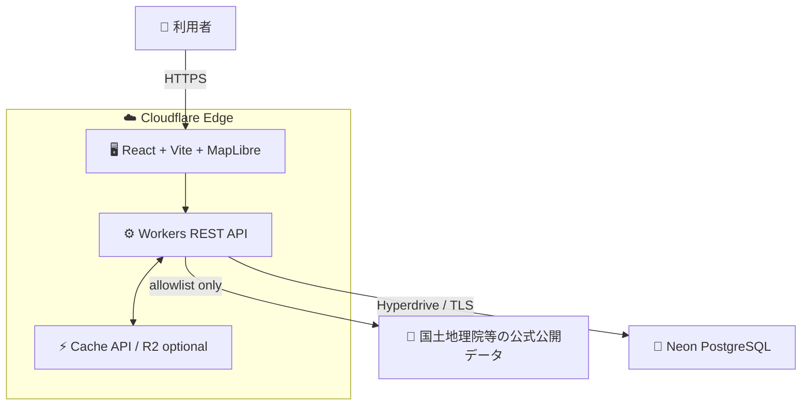
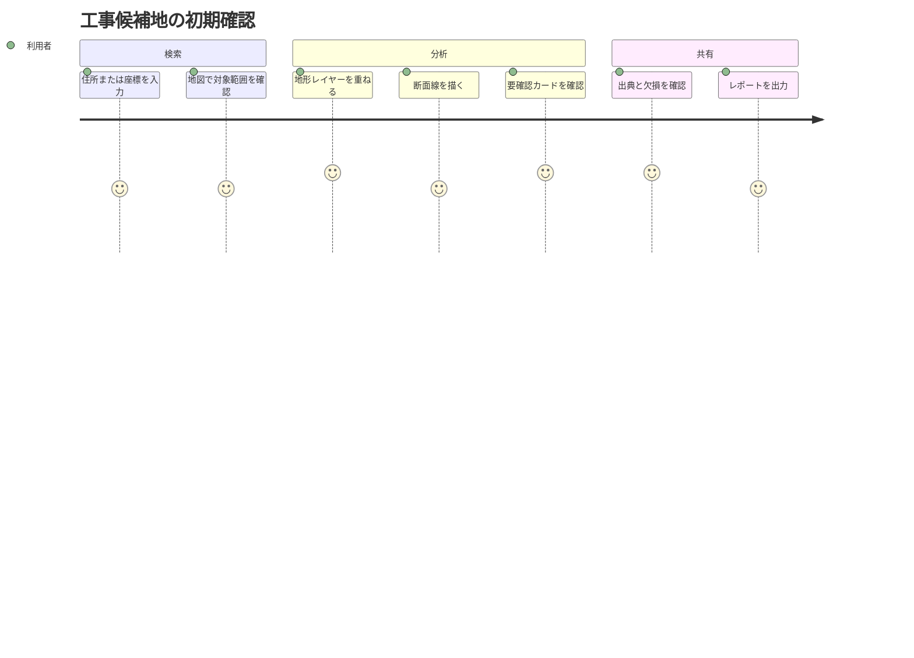
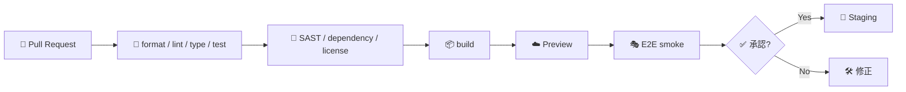
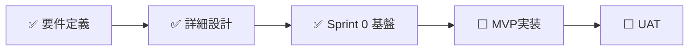

# 🗺️ Civil Terrain & Slope Risk Viewer

> ⛰️ 公開地形データから、工事候補地の標高・傾斜・地形分類を可視化し、現地調査や専門確認へ進むための論点を素早く揃えるWebシステムです。

> 📘 **状態:** Sprint 0完了　🚧 **段階:** MVP実装準備　🎯 **対象:** MVP　📄 **ライセンス:** 未決定

> [!IMPORTANT]
> 現在のリポジトリは **MVP実装中 (Sprint 2進行中)** です。Sprint 0でmonorepo基盤・ゴールデンfixture・CIが、Sprint 1でMapLibre地図表示とPlaywright E2Eが完了し、Sprint 2で単点標高API `GET /elevation` を実装しています。`pnpm install && pnpm test` (200件) と `pnpm test:e2e` (CI) がグリーンです。地形分析・断面分析・確認支援・レポート出力はこれから実装します。

## 🌟 目指すもの

土工・造成・仮設ヤード・搬入路などの初期検討では、標高差、急傾斜、谷、崖、低地といった情報が複数の公開サイトに分散しています。本プロジェクトは、それらを一つの地図と根拠付きレポートにまとめます。


## ✨ MVP機能

| 領域          | 計画機能                                   | 状態              |
| ------------- | ------------------------------------------ | ----------------- |
| 📍 地点指定   | 住所、緯度経度、地図クリック、現在地       | 📝 設計済み       |
| 🗺️ 地図       | 標準地図、陰影起伏、傾斜量、地形分類       | 🚧 Sprint 1実装中 |
| ⛰️ 地形分析   | 標高統計、傾斜区分、谷・崖・低地等の抽出   | 📝 設計済み       |
| 📈 断面分析   | 任意線の標高断面、累積上昇・下降、最大傾斜 | 📝 設計済み       |
| ⚠️ 確認支援   | 要確認・参考情報・判定不能の根拠付きカード | 📝 設計済み       |
| 🧾 共有・出力 | 共有URL、Markdown、CSV、JSON               | 📝 設計済み       |
| 🔎 品質表示   | 出典、取得日時、解像度、欠損率、加工方法   | 📝 設計済み       |

## 🚧 重要な利用上の制約

本システムは **調査入口・初期検討支援** であり、次の業務を代替しません。

- 📏 測量、地質調査、現地踏査、設計計算
- 🏗️ 施工可否、切盛土量、安全率の確定
- ⚖️ 法令・条例・公式ハザード区域の行政判断
- 🚨 リアルタイム災害監視、避難判断、警報

`データなし` や `判定不能` を「安全」や「リスクなし」として扱わないことが中核原則です。

## 🏛️ 計画アーキテクチャ



| レイヤー    | 採用方針                                             |
| ----------- | ---------------------------------------------------- |
| 🖥️ Frontend | React / TypeScript / Vite / MapLibre GL JS           |
| ⚙️ API      | Cloudflare Workers / TypeScript / REST / OpenAPI 3.1 |
| 🧠 分析     | DEM PNGデコード、Horn法、地形分類アダプター          |
| 🐘 Database | Neon PostgreSQL、利用可能ならPostGIS                 |
| ⚡ Cache    | Cloudflare Cache API、必要時のみR2                   |
| 🔁 CI/CD    | GitHub Actions、Preview、Playwright smoke            |

詳しくは [アーキテクチャ](docs/アーキテクチャ.md) と [詳細設計仕様書](地形傾斜リスク可視化システム詳細設計仕様書.md) を参照してください。

## 🧭 想定ユーザーフロー



## 📚 ドキュメント

| 読みたい内容                | ドキュメント                                                     |
| --------------------------- | ---------------------------------------------------------------- |
| 🧭 全文書の入口             | [ドキュメント一覧](docs/ドキュメント一覧.md)                     |
| 🚀 開発開始手順             | [開発開始ガイド](docs/開発開始ガイド.md)                         |
| 👤 利用者ガイド             | [利用者ガイド](docs/利用者ガイド.md)                             |
| 🏛️ システム構成             | [アーキテクチャ](docs/アーキテクチャ.md)                         |
| 🔌 API契約                  | [インターフェース仕様](docs/インターフェース仕様.md)             |
| 🗃️ データ・DB               | [データ設計](docs/データ設計.md)                                 |
| 🔐 セキュリティ             | [セキュリティ](docs/セキュリティ.md)                             |
| ✅ テスト・品質             | [テスト品質戦略](docs/テスト品質戦略.md)                         |
| 🚀 デプロイ                 | [デプロイとリリース](docs/デプロイとリリース.md)                 |
| 🛠️ 運用・障害対応           | [運用と障害対応](docs/運用と障害対応.md)                         |
| 🗺️ 実装ロードマップ         | [ロードマップ](docs/ロードマップ.md)                             |
| 🤝 開発参加                 | [開発参加ガイド](docs/開発参加ガイド.md)                         |
| ♿ UI・アクセシビリティ     | [画面設計とアクセシビリティ](docs/画面設計とアクセシビリティ.md) |
| 📋 要件トレーサビリティ     | [要件トレーサビリティ](docs/要件トレーサビリティ.md)             |
| ⚖️ ガバナンス・プライバシー | [ガバナンスとプライバシー](docs/ガバナンスとプライバシー.md)     |
| ❓ よくある質問・用語       | [よくある質問と用語集](docs/よくある質問と用語集.md)             |

## 🚀 開発を始める

Sprint 0でmonorepo基盤・スケルトン実装・ゴールデンfixture・CI設定が完了し、以下のコマンドがローカルで再現できます。

```bash
pnpm install --frozen-lockfile   # 依存関係を導入
pnpm lint                        # 静的検査
pnpm typecheck                   # TypeScript strict検査 (tests/fixtures含む)
pnpm test                        # 単体テスト (200件)
pnpm build                       # 全ワークスペースをビルド
pnpm format                      # コードスタイル検査
```

```text
apps/web       React + Vite UI (スケルトン実装済み)
apps/api       Cloudflare Workers API (スケルトン実装済み)
packages/*     domain / geo / adapters / db / ui (スケルトン実装済み)
tests/fixtures 合成ゴールデンDEMデータ (実装済み)
tests/*        integration / e2e (未着手)
```

実装開始時の判断基準は [開発開始ガイド](docs/開発開始ガイド.md)、完了条件は [テスト品質戦略](docs/テスト品質戦略.md) を参照してください。

## 🛡️ 品質ゲート



## 📊 現在地



- ✅ 要件定義書 v1.0.0
- ✅ 詳細設計仕様書 v1.0.0
- ✅ README・docs初版
- ✅ Sprint 0: monorepoスケルトン実装 (`apps/*`, `packages/*`) + ゴールデンfixture (当時121テスト、現在200テスト全パス)
- ✅ OpenAPI 3.1初版 (`openapi/openapi.yaml`)
- ✅ CI (`.github/workflows/ci.yml`、GitHub Actions実環境でPR #1にて成功確認済み。secret scan/SASTはSprint 1以降)
- 🚧 MVP機能実装 — Sprint 1で実装済み: MapLibre地図表示 (GSI標準/淡色/写真 + 傾斜量・陰影起伏の切替、帰属常設、表示状態の共有URLハッシュ)。Sprint 2で実装済み: 単点標高API `GET /elevation` (GSI DEMタイル取得→PNG復号→出典・品質付き応答、Web標準stream採用でWorkers/Node両対応)。未着手: 地図UIからの地点指定連携・地形分析・断面分析・確認支援・レポート出力 (Markdown/CSV/JSON)
- ⬜ Preview / Staging環境
- ⬜ UAT・セキュリティ確認

## 🤝 コントリビューション

変更は小さな単位で行い、要件ID・テスト・文書を紐付けてください。未検証の変更は完了扱いにしません。詳しくは [開発参加ガイド](docs/開発参加ガイド.md) を参照してください。

## 📄 ライセンスとデータ帰属

ソースコードのライセンスは未決定です。公開前にライセンス文書を追加してください。国土地理院等の外部データは各提供元の規約に従い、画面・出力へ出典と加工注記を表示します。詳細は [データ設計](docs/データ設計.md) を参照してください。

---

> 🧭 **判断のための地図であり、判断そのものではない。**
