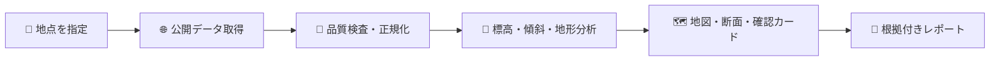
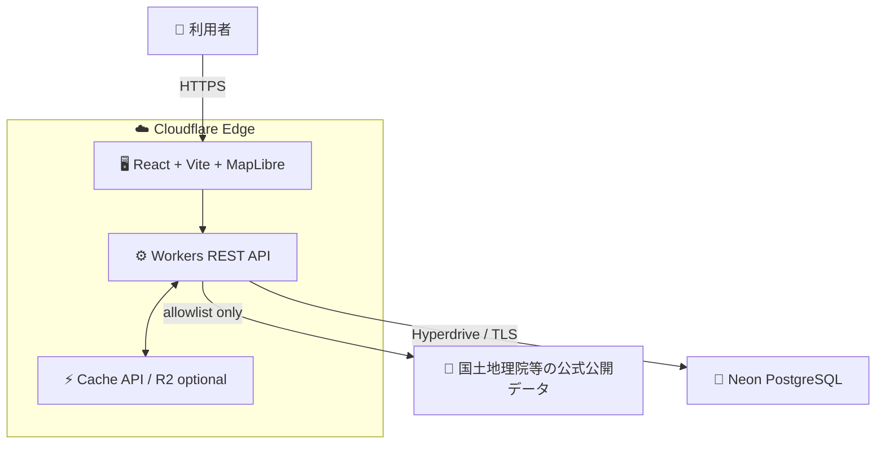
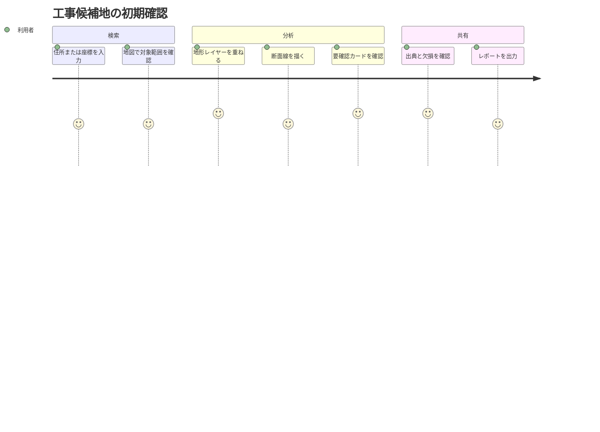
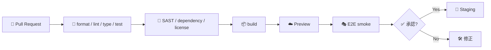
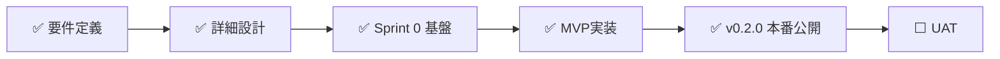

# 🗺️ Civil Terrain & Slope Risk Viewer

> ⛰️ 公開地形データから、工事候補地の標高・傾斜・地形分類を可視化し、現地調査や専門確認へ進むための論点を素早く揃えるWebシステムです。

> 📘 **状態:** v0.3.0本番稼働 (ハザード・履歴・PWA)　🚧 **段階:** MVP実装中　🎯 **対象:** MVP　📄 **ライセンス:** 未決定

> [!IMPORTANT]
> 現在のリポジトリは **MVP実装中 (v0.2.1 本番稼働 + 評価改善・追加実装適用)** です。Sprint 0でmonorepo基盤・ゴールデンfixture・CIが、Sprint 1でMapLibre地図表示とPlaywright E2Eが完了し、Sprint 2で単点標高API・地形分析・断面分析・確認支援・共有URLが実装されています。2026-08-12の評価改善でレポート出力・レート制限・Access JWT検証・カバレッジゲート等を、追加実装で土砂災害警戒区域レイヤー・分析履歴・PWAを追加しました。`pnpm install && pnpm test` (370件) と `pnpm test:coverage` (80%ゲート) がグリーンです。

## 🌟 目指すもの

土工・造成・仮設ヤード・搬入路などの初期検討では、標高差、急傾斜、谷、崖、低地といった情報が複数の公開サイトに分散しています。本プロジェクトは、それらを一つの地図と根拠付きレポートにまとめます。



## ✨ MVP機能

| 領域              | 計画機能                                                                          | 状態                                                |
| ----------------- | --------------------------------------------------------------------------------- | --------------------------------------------------- |
| 📍 地点指定       | 住所、緯度経度、地図クリック、現在地                                              | ✅ 検索(地名/座標)・クリック済 (現在地未対応)       |
| 🗺️ 地図           | 標準地図、陰影起伏、傾斜量、地形分類、土砂災害警戒区域 (土石流/急傾斜地/地すべり) | ✅ Sprint 1実装済 + 公式ハザードレイヤー追加        |
| ⛰️ 地形分析       | 標高統計、傾斜区分、谷・崖・低地等の抽出                                          | ✅ v0.2.0実装済 (Horn傾斜統計+TPI分類)              |
| 📈 断面分析       | 任意線の標高断面、累積上昇・下降、最大傾斜                                        | ✅ v0.2.0実装済 (2点指定・欠損は非補間)             |
| ⚠️ 確認支援       | 要確認・参考情報・判定不能の根拠付きカード                                        | ✅ v0.2.0実装済 (実測メトリクスのルール評価)        |
| 🧾 共有・出力     | 共有URL、Markdown、CSV、JSON                                                      | ✅ 共有URL + MD/CSV/JSON レポート出力 (v0.2.1)      |
| 🔎 品質表示       | 出典、取得日時、解像度、欠損率、加工方法                                          | ✅ v0.2.0実装済 (グレード・欠損率・出典)            |
| 🗂️ 分析履歴       | ブラウザ内保存・一覧・削除・2地点比較・初回評価用デモサンプル                     | ✅ 追加実装 (localStorage 最大30件・サーバー非送信) |
| 📱 PWA/オフライン | インストール可能・アプリシェルオフライン                                          | ✅ 追加実装 (API/タイルはキャッシュしない)          |

## 🚧 重要な利用上の制約

本システムは **調査入口・初期検討支援** であり、次の業務を代替しません。

- 📏 測量、地質調査、現地踏査、設計計算
- 🏗️ 施工可否、切盛土量、安全率の確定
- ⚖️ 法令・条例・公式ハザード区域の行政判断
- 🚨 リアルタイム災害監視、避難判断、警報

`データなし` や `判定不能` を「安全」や「リスクなし」として扱わないことが中核原則です。

## 🏛️ 計画アーキテクチャ



| レイヤー    | 採用方針                                             |
| ----------- | ---------------------------------------------------- |
| 🖥️ Frontend | React / TypeScript / Vite / MapLibre GL JS           |
| ⚙️ API      | Cloudflare Workers / TypeScript / REST / OpenAPI 3.1 |
| 🧠 分析     | DEM PNGデコード、Horn法、地形分類アダプター          |
| 🐘 Database | Neon PostgreSQL、利用可能ならPostGIS                 |
| ⚡ Cache    | Cloudflare Cache API、必要時のみR2                   |
| 🔁 CI/CD    | GitHub Actions、Preview、Playwright smoke            |

詳しくは [アーキテクチャ](docs/アーキテクチャ.md) と [詳細設計仕様書](地形傾斜リスク可視化システム詳細設計仕様書.md) を参照してください。

## 🧭 想定ユーザーフロー



## 📚 ドキュメント

| 読みたい内容                | ドキュメント                                                     |
| --------------------------- | ---------------------------------------------------------------- |
| 🧭 全文書の入口             | [ドキュメント一覧](docs/ドキュメント一覧.md)                     |
| 🚀 開発開始手順             | [開発開始ガイド](docs/開発開始ガイド.md)                         |
| 👤 利用者ガイド             | [利用者ガイド](docs/利用者ガイド.md)                             |
| 🏛️ システム構成             | [アーキテクチャ](docs/アーキテクチャ.md)                         |
| 🔌 API契約                  | [インターフェース仕様](docs/インターフェース仕様.md)             |
| 🗃️ データ・DB               | [データ設計](docs/データ設計.md)                                 |
| 🔐 セキュリティ             | [セキュリティ](docs/セキュリティ.md)                             |
| ✅ テスト・品質             | [テスト品質戦略](docs/テスト品質戦略.md)                         |
| 🚀 デプロイ                 | [デプロイとリリース](docs/デプロイとリリース.md)                 |
| 🛠️ 運用・障害対応           | [運用と障害対応](docs/運用と障害対応.md)                         |
| 🗺️ 実装ロードマップ         | [ロードマップ](docs/ロードマップ.md)                             |
| 🤝 開発参加                 | [開発参加ガイド](docs/開発参加ガイド.md)                         |
| ♿ UI・アクセシビリティ     | [画面設計とアクセシビリティ](docs/画面設計とアクセシビリティ.md) |
| 📋 要件トレーサビリティ     | [要件トレーサビリティ](docs/要件トレーサビリティ.md)             |
| ⚖️ ガバナンス・プライバシー | [ガバナンスとプライバシー](docs/ガバナンスとプライバシー.md)     |
| 🤖 AI活用方針               | [AI支援機能設計書](docs/AI支援機能設計書.md)                     |
| 📄 ライセンス               | [ライセンスとOSS方針](docs/ライセンスとOSS方針.md)               |
| ❓ よくある質問・用語       | [よくある質問と用語集](docs/よくある質問と用語集.md)             |

## 🚀 開発を始める

Sprint 0でmonorepo基盤・スケルトン実装・ゴールデンfixture・CI設定が完了し、以下のコマンドがローカルで再現できます。

```bash
pnpm install --frozen-lockfile   # 依存関係を導入
pnpm lint                        # 静的検査
pnpm typecheck                   # TypeScript strict検査 (tests/fixtures含む)
pnpm test                        # 単体テスト (370件)
pnpm test:coverage               # カバレッジ計測 + 80%ゲート (実測93%超)
pnpm build                       # 全ワークスペースをビルド
pnpm format                      # コードスタイル検査
```

```text
apps/web       React + Vite UI (MVP実装済み。初回評価用の架空デモ分析3件を同梱)
apps/api       Cloudflare Workers API (health / elevation / capabilities / sources)
packages/*     domain / geo / adapters / db / ui
tests/fixtures 合成ゴールデンDEMデータ (実装済み)
tests/e2e      Playwright smoke (地図・標高・分析タブ)
```

実装開始時の判断基準は [開発開始ガイド](docs/開発開始ガイド.md)、完了条件は [テスト品質戦略](docs/テスト品質戦略.md) を参照してください。

## 🛡️ 品質ゲート



## 📊 現在地



- 🚀 **本番稼働中 (v0.2.0)**: <https://terrain-slope.mirai-dx-platform.com> — 統合Cloudflare Worker (SPA + API 単一オリジン)。カスタムドメイン割当済み (PR #30/#31。workers.dev URL は無効化し正規URLへ一本化)
- 🧪 **MVP/Prototype確認用URL**: <https://mvp-slope.mirai-dx-platform.com> — 本番URLと誤認しないための評価用サブドメイン。`wrangler --env mvp` で `civil-terrain-api-mvp` へ分離してdeployする
- ✅ 要件定義書 v1.0.0 / 詳細設計仕様書 v1.0.0 / OpenAPI 3.1初版 (`openapi/openapi.yaml`)
- ✅ Sprint 0: monorepoスケルトン (`apps/*`, `packages/*`) + ゴールデンfixture (現在291テスト全パス)
- ✅ CI (`.github/workflows/ci.yml`、Node 22。lint/format/typecheck/test/build/Workers bundle dry-run/E2E smoke/dependency audit)
- ✅ セキュリティCI (`.github/workflows/security.yml`。secret scan=gitleaks・SAST=semgrep をPR/mainで強制 → Issue #2)
- ✅ 地図表示 (Sprint 1): MapLibre + GSI 標準/淡色/写真 + 傾斜量・陰影起伏、帰属常設、共有URLハッシュ
- ✅ 単点標高 (Sprint 2): `GET /api/v1/elevation` (GSI DEMタイル→PNG復号→出典・品質付き応答) + クリック→標高パネル (欠損・判定不能に「安全を意味しない」を常記)
- ✅ 再設計100%適用 (PR #27): 5タブUI・地点検索 (地名/緯度経度)・選択地点マーカー・DEM状態表示・出力タブ
- ✅ 分析3タブ本番実装 (PR #28): 地形分析 (Horn傾斜統計 30°=急傾斜地法基準 + TPI地形分類)・断面分析 (2点指定→縦断プロファイル、欠損非補間)・確認支援 (実測メトリクスのルール評価)。GSI DEM実データのクライアントサイド解析、検索リセット付き
- ✅ 評価改善 (2026-08-12): APIレート制限 (429+Retry-After) / Cloudflare Access JWTのWorker側検証 (設定時のみ。片方欠け設定は保護ルート503) / `GET /capabilities`・`GET /sources` 実装 / レポート出力 (Markdown・CSV・JSON、クライアントサイド保存、出典・判定不能を明記) / テストカバレッジ80%ゲート (実測93%) / コード分割 (初期JS 1.26MB→約205KB、MapLibreは遅延読み込み) / スキップリンク・prefers-reduced-motion・タッチターゲット44px等のアクセシビリティ改善 / WebGL不可環境でも地図以外を継続利用できるエラーバウンダリ / CSP meta廃止とGoogle Fonts許可 (開発・E2E互換の欠陥修正)
- ✅ 追加実装 (2026-08-12 第2弾 + 2026-08-13 MVPデモ): 重ねるハザードマップ「土砂災害警戒区域」3種 (土石流/急傾斜地/地すべり) の重畳 (CSP・E2E対応込み) / 分析履歴 (localStorage・一覧・開く・削除・2地点比較) / 初回評価用の架空デモ分析3件 / PWA (manifest・アイコン生成・Service Worker。API・外部タイルはキャッシュしない) / ライセンス方針・AI支援機能設計書
- ✅ v0.3.0 リリース (2026-08-12): PR #4 マージ → CI全成功 (E2E 9/9) → 本番デプロイ (Version `8437425b-83eb-460b-9e0f-3482aad6bac6`) → タグ v0.3.0 / GitHub Release 作成
- 🚧 既知の制約: `GET /api/v1/health/ready` は503 (Neon未接続の正直な報告。DB利用機能はSprint 3+)。E2Eはローカル実行環境でheadless Chromeが起動できないためCI依存 (2026-08-12 PR #4 CIで9/9 PASS)。Access Group は未作成 (RBAC本番有効化待ち)。Neon はプラン上限のためプロビジョニング待ち
- ⬜ 残: Access Group作成・secret登録 / 本番スモーク15項目・実機UAT / Neon接続 / アラート作成 (通知API権限待ち) / 監査ログDB永続化 / グローバルRate Limiting / AI支援パイロット (予算承認後)

## 🤝 コントリビューション

変更は小さな単位で行い、要件ID・テスト・文書を紐付けてください。未検証の変更は完了扱いにしません。詳しくは [開発参加ガイド](docs/開発参加ガイド.md) を参照してください。

## 📄 ライセンスとデータ帰属

ソースコードのライセンスは未決定です。公開前にライセンス文書を追加してください。国土地理院等の外部データは各提供元の規約に従い、画面・出力へ出典と加工注記を表示します。詳細は [データ設計](docs/データ設計.md) を参照してください。

---

> 🧭 **判断のための地図であり、判断そのものではない。**
