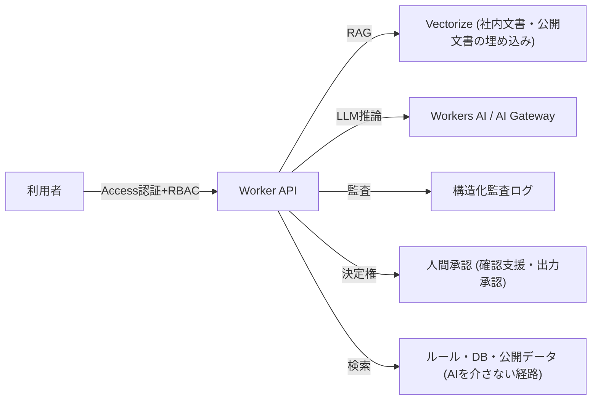

# 🤖 AI支援機能設計書 (v0.1 設計案)

> 最終更新: 2026-08-12 / 状態: **設計 (実装未着手)** / 対象読者: IT・DX部門、経営層、AI評価者

## 1. 目的と適用範囲

本システムに AI を追加する場合、**チャット追加を目的化しない**。時間削減・検索/判断支援・
説明可能性・安全性・費用対効果のいずれかが明確に改善し、かつ測定できる場合だけ採用する。
本設計書は、要件・権限・監査・責任分界・停止手段を含む「本番運用可能な AI 支援」の設計案である。

## 2. 基本原則

| 原則                             | 設計への落とし込み                                                             |
| -------------------------------- | ------------------------------------------------------------------------------ |
| 時間削減                         | 測定対象: 1調査あたりの所要時間、検索回数、レポート作成時間                    |
| 判断支援であり判断の代替ではない | AI出力は「候補・根拠付き参考」とし、最終判断は人間                             |
| 説明可能性                       | 出力ごとに根拠 (引用URL・条文・タイル・計算式) と信頼度を必須表示              |
| 安全性                           | 危険区域・法規・工事可否の断定を禁止するシステムプロンプトと出力フィルタ       |
| 費用対効果                       | トークン・埋め込み・ベクトル検索の単価と利用量を事前見積もりし、予算上限で停止 |

## 3. ユースケース候補 (優先度順)

| #   | ユースケース                                        | 種別       | 効果                               | 対象者       | 難易度 | 優先度 |
| --- | --------------------------------------------------- | ---------- | ---------------------------------- | ------------ | ------ | ------ |
| A1  | 業務手順・用語・規約の RAG アシスタント             | RAG        | 問い合わせ削減、手順検索時間の短縮 | 現場・IT・DX | 中     | 高     |
| A2  | 工事計画書 PDF から対象地点・断面・面積の構造化抽出 | 構造化抽出 | 入力転記の削減、誤入力防止         | 現場・設計   | 中     | 高     |
| A3  | 要確認カードの優先度順ソート提案                    | 分類       | 現地調査計画の効率化               | 現場         | 低     | 中     |
| A4  | DEM 品質・取得パターンの異常検知                    | 異常検知   | データ品質監視の自動化             | IT・DX       | 高     | 中     |
| A5  | 複数地点のリスク指標サマリ生成 (根拠引用付き)       | 生成支援   | 報告書素案の作成時間削減           | 現場・経営   | 中     | 中     |

## 4. AI不要でルール・検索が適切な領域

以下の領域は AI を導入せず、既存のルール・検索・数値計算を維持する。

- 標高・傾斜・地形分類 (DEM からの数値計算: AI は近似せず実計算を正とする)
- 要確認カードの生成 (実測メトリクス vs 閾値のルール評価)
- 土砂災害警戒区域の表示 (公式タイルの重畳。AI による区域解釈をしない)
- 共有URL・レポート出力 (決定的な変換)
- 認証・権限・監査 (ルールベースが必須)

## 5. 全体アーキテクチャ

- 文書は正本 (GitHub docs・公開元一次情報) を定期的に再取得し、ベクトル索引の版と更新日を管理する。
- AI 応答と非 AI 応答を明確に区別し、UI に「AI支援」バッジを表示する。

## 6. モデル構成・根拠・引用・信頼度

- モデル選定基準: 日本語性能、出力JSONの安定性、コスト、データ保持 (契約上の外部送信禁止)、
  レイテンシ。小規模タスクは専用小モデル、RAG は埋め込み + 生成モデルを分離する。
- 全出力に次を付与する:
  - 根拠: 引用URL・文書ID・セクション・取得日時
  - 信頼度: `HIGH / MEDIUM / LOW / 判定不能`。根拠が取得できない場合は LOW にし、推測を
    HIGH にしない
  - アルゴリズム版 (モデル名・プロンプト版・埋め込み索引版)
- 数値・区域・法規に関する出力は「AI が断定しない」制約をプロンプトと出力検証の両方で強制する。

## 7. 人間承認フロー

- 閲覧・検索支援: 承認なし (読み取り専用)
- レポートへの AI サマリ反映: Analyst 以上が編集・承認
- 要確認カードの自動発行: 承認なしだが、AI カードはルールカードと別種別で表示
- 外部送信・公開・DB 書き込み: DataAdmin/SystemAdmin の承認と操作監査ログ
- 全ての AI 出力は「草案」であり、最終版へ取り込む操作を明示的に行う

## 8. 権限制御・プロンプトインジェクション対策

- RBAC を AI 機能にも適用: Viewer は既存知識の検索、Analyst 以上は構造化抽出・サマリ生成、
  DataAdmin 以上は文書索引の更新・プロンプト変更
- 文書は信頼済みソース (GitHub docs・公開一次情報) のみ索引化し、利用者アップロード文書は
  サンドボックスで検証後に索引化
- プロンプトインジェクション対策:
  - システムプロンプトと利用者入力を分離し、利用者入力は「データ」として扱う
  - 文書内の指示文 (「無視して…」等) を出力へ反映しない旨を固定文言化
  - 出力フィルタで URL スキーム・機密パターン・決定的禁止語を検査
  - 入力長・ファイル種別・内容サイズの上限
- プロンプト・索引・出力はバージョン管理し、変更は PR と DataAdmin 承認を必須とする

## 9. 個人・機密情報保護

- 入力・出力・ログに氏名・住所・メール・座標等の PII を含めない (座標は粗いタイル単位へ丸める)
- 社外秘文書は既定で索引化しない。索引化する場合は契約・法務の確認とアクセス権の紐付けを行う
- モデル提供事業者へデータを送信しない構成 (Cloudflare Workers AI 等のデータ保持なしプランを確認) を前提とする
- 保持期間: プロンプト・出力 90日、監査ログ 1年 (既存方針と同一)

## 10. 監査 (モデル・プロンプト・入出力)

監査イベント例 (`audit_logs` テーブル・Workers Logs の両方):

| イベント    | 記録内容                                             |
| ----------- | ---------------------------------------------------- |
| AI_REQ      | 利用者 (sub)、ユースケース、入力長、索引版、モデル名 |
| AI_RES      | 信頼度、引用数、レイテンシ、トークン数、出力検証結果 |
| AI_REFUSED  | 禁止カテゴリ (断定・PII・危険区域解釈) の検出        |
| AI_APPROVED | 人間承認の操作者・判断・版                           |
| AI_BUDGET   | 日次/月次利用量と予算上限到達                        |

監査ログは API 経由で SystemAdmin のみ読み取れるようにする。

## 11. 誤判定時の責任分界

- AI 出力はあくまで草案であり、工事可否・安全・法令判断の根拠としないことを
  利用規約・画面・レポートに明記する
- 誤判定の報告窓口と再発防止 (テスト追加・プロンプト修正・索引修正) を定める
- ルール評価と AI 評価が矛盾する場合は**ルール評価を正**とし、AI 側はフラグ表示のみ
- 重大事故に繋がる可能性がある誤判定は、停止ボタンと関係者通知の対象とする

## 12. 利用量・予算上限・停止手段

- 日次/月次のトークン・リクエスト・コスト上限を env で設定し、超過時は AI 機能を
  自動的に「停止 (ルール機能へフォールバック)」する
- ダッシュボードまたは API から即時停止可能なスイッチを用意する
- 停止状態は `/capabilities` で公開し、UI に「AI支援: 一時停止中」を表示する
- コストはユースケースごとに測定し、時間削減効果と比較して継続可否を四半期で判断する

## 13. 費用対効果の評価指標

| 指標               | 目標 (例)                      | 測定方法                  |
| ------------------ | ------------------------------ | ------------------------- |
| 手順検索時間       | 1回あたり 10分 → 2分以内       | ユーザーアンケート + ログ |
| レポート素案作成   | 30分 → 10分以内                | UAT 計測                  |
| AI 1問あたりコスト | 5円以下                        | 利用量ログ                |
| 月間AI予算         | 10,000円以下 (600名規模の初期) | 予算ダッシュボード        |
| 誤判定報告         | 月1件以下                      | 監査ログ                  |

## 14. 実装ロードマップと完了条件

1. Phase 3-1: 文書の選定と信頼済みソースの確認 (GitHub docs・公開一次情報のみ)
2. Phase 3-2: RAG パイロット (利用者 10名、2週間) で時間削減と誤判定率を測定
3. Phase 3-3: 構造化抽出 (PDF) の精度検証と人間承認フロー
4. Phase 3-4: 監査・予算上限・停止手段の本番化

完了条件: パイロットで時間削減が実測され、誤判定報告0、予算内、監査ログが
SystemAdmin から参照可能、停止手段の実演が完了していること。

**現時点の判断: 実装は着手しない。** ルール機能・公式ハザード表示・クライアント履歴の
安定化と UAT 完了を優先し、AI は本設計書に基づき予算承認後にパイロットへ進める。
