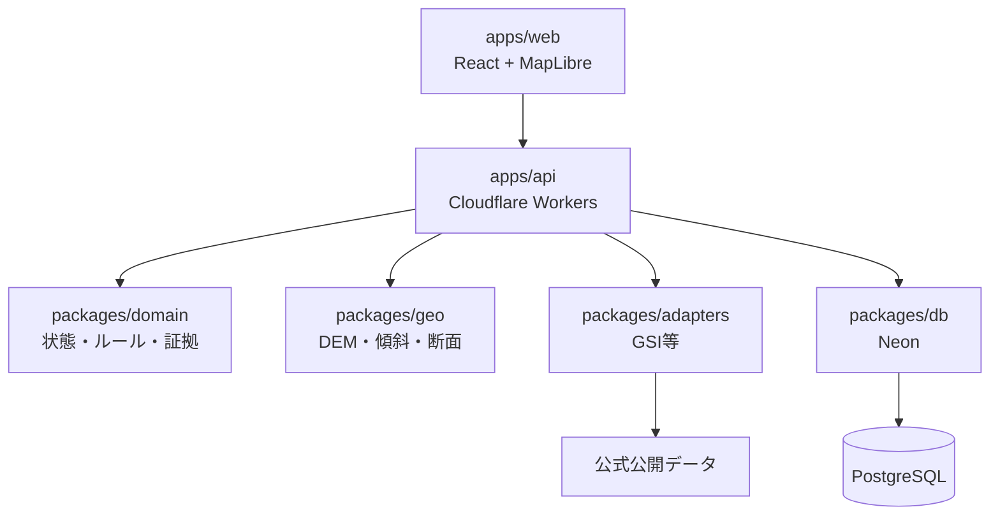
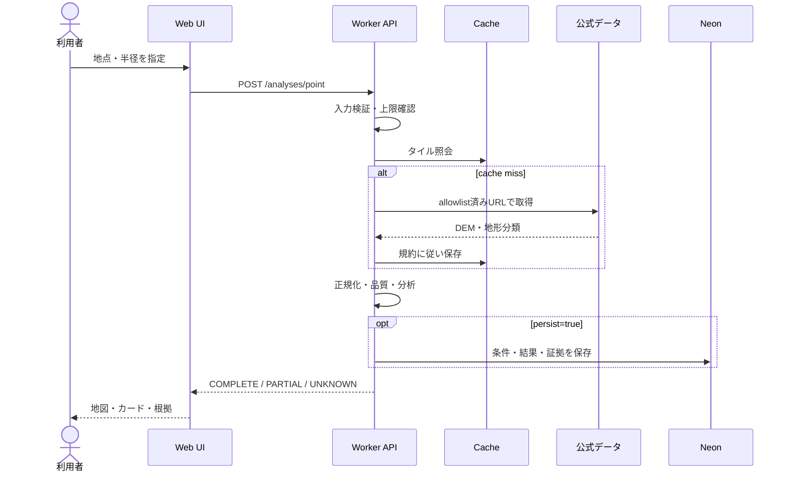

# 🏛️ アーキテクチャ

## 🎯 設計原則

- UI、API、データアダプター、分析エンジンを分離する
- 外部障害時は縮退し、`UNKNOWN`を安全扱いしない
- すべての結果に証拠、データ版、アルゴリズム版を結び付ける
- ブラウザからDBへ直接接続しない
- 公開データ取得先はサーバー側allowlistで制御する

## 🧩 コンポーネント

依存方向は外側から内側へ向け、`domain`と`geo`がCloudflare、React、DBクライアントへ依存しない構成を目標とします。

## 🔄 地点分析シーケンス

## 🧯 縮退方針

| 障害 | 継続できること | 表示 |
| --- | --- | --- |
| DEM停止 | キャッシュ済み表示のみ | 古さと判定不能を明示 |
| 地形分類停止 | DEM由来の分析 | `PARTIAL` |
| Neon停止 | 非保存の一時分析 | 保存不可を明示 |
| 設定破損 | last-known-good | ready=false |

## 📌 主要判断

重要な設計判断は [設計判断記録](設計判断記録/設計判断記録一覧.md) に記録します。初期判断は「Cloudflare Workers + Neon」「DEM数値評価はPNGから再計算」「総合危険度を作らない」です。
