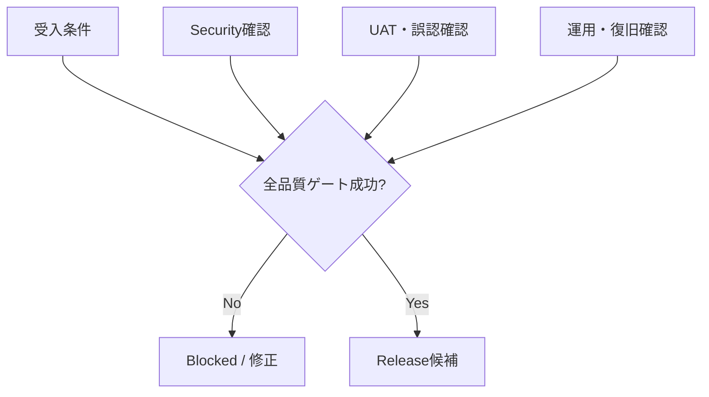

# ⚖️ ガバナンス・プライバシー

## 📌 文書と正本

要件の正本はルートの要件定義書、技術仕様の正本は詳細設計仕様書です。READMEとdocsは利用・実装・運用の入口として同期します。矛盾を見つけた場合は、Issue化して影響を確認し、原典と派生文書を同じ変更で更新します。

## 🔒 プライバシー

- 会社資産、案件情報、個人情報、写真、図面はMVP対象外
- 端末現在地は利用者操作と明示許可がある時だけ取得
- 匿名分析は既定非保存
- 共有URLには住所文字列、現在地履歴、自由記述を原則含めない
- ログには完全IPや精密座標を残さず、必要時は粗いtile ID等を使う
- 誤入力が判明した場合の削除窓口と手順は本番前に確定する

## 📊 KPI候補

| KPI | MVP目標 |
| --- | ---: |
| 初期確認完了時間中央値 | 5分以内 |
| 分析成功率（外部障害除く） | 98%以上 |
| 出典表示率 | 100% |
| 欠損の明示率 | 100% |
| 同条件再現率 | 100% |
| UAT有用評価 | 80%以上 |
| 確定判断と誤認した利用者 | 0人目標 |

## ⚠️ リスク台帳

| リスク | 影響 | 基本対策 |
| --- | --- | --- |
| 公開データ境界の誤解 | 誤判断 | 境界精度・欠損・出典を常設表示 |
| 外部仕様・規約変更 | 停止・違反 | source版管理、契約試験、手動再承認 |
| 傾斜色の危険判定化 | 過信 | 法令基準ではないと明記 |
| 位置情報の過剰保存 | privacy侵害 | 明示persist、最小化、期限削除 |
| 外部障害を安全扱い | 見落とし | UNKNOWN/PARTIAL優先 |
| キャッシュによる古さ | 根拠不一致 | 取得日時、ETag、TTL、version表示 |

## 🚦 リリース判定

重大不具合、セキュリティ上の阻害要因、未検証のデータベース移行、復元不能、出典欠落が1件でもあればリリースしません。本番公開はMVP実装・UAT後に別途承認します。

## 🧾 変更管理

Semantic Versioningの採否とライセンスはSprint 0で決定します。リリースごとに変更、破壊的変更、migration、既知制約、データ/設定/アルゴリズム版を記録します。
