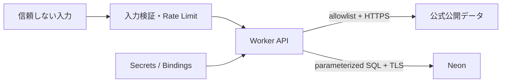

# 🔐 セキュリティ

## 🛡️ 信頼境界

## ⚠️ 主な脅威と対策

| 脅威           | 制御                                                                                       |
| -------------- | ------------------------------------------------------------------------------------------ |
| SSRF           | URLテンプレート、host/IP/redirect allowlist、private IP拒否                                |
| SQL injection  | Zod、パラメータ化SQL、識別子allowlist                                                      |
| Secret漏えい   | Worker Secret/Binding、secret scan、ログredaction                                          |
| 位置情報漏えい | 明示許可、既定非保存、ログは粗いtile/geohash                                               |
| CSV式注入      | `= + - @`等を無害化                                                                        |
| 履歴の端末残留 | 分析履歴は localStorage のみ。明示削除・全件削除・ブラウザデータ削除で消去。サーバー非送信 |
| XSS            | HTML無効のMarkdown、CSP、出力escape                                                        |
| DoS/コスト増   | 面積・点数・byte・time上限、Rate Limit、cache                                              |
| 誤判定         | UNKNOWN優先、欠損明示、総合危険度を作らない                                                |

## 🔑 認可

| Role        | 分析 | 保存 | ソース設定 | 監査 |
| ----------- | :--: | :--: | :--------: | :--: |
| Anonymous   | 制限 |  -   |     -      |  -   |
| Viewer      |  ✓   |  -   |     -      |  -   |
| Analyst     |  ✓   |  ✓   |     -      |  -   |
| DataAdmin   |  ✓   |  ✓   |     ✓      | 読取 |
| SystemAdmin |  ✓   |  ✓   |     ✓      |  ✓   |

限定検証ではCloudflare Access JWTをWorker側で検証し、UI表示だけに依存しません。
RBAC は JWT の `groups` クレームと env で指定する Access Group ID の対応で判定します
(`apps/api/src/security/rbac.ts`)。未設定時は認証済みユーザー全員を Viewer とします。
保護対象ルート (`/elevation`, `/health/ready`) の成功・拒否・エラーは構造化監査イベント
(`apps/api/src/observability.ts`) として Workers Logs へ出力します。監査ログに
座標・メールアドレス・トークンは含めません (利用者識別は JWT の `sub` のみ)。

## ✅ 実装済み (2026-08-12 評価改善)

| 対策                        | 実装                                                                                                                                                                                                          | 検証                                                                                                        |
| --------------------------- | ------------------------------------------------------------------------------------------------------------------------------------------------------------------------------------------------------------- | ----------------------------------------------------------------------------------------------------------- |
| Rate Limit (DoS/コスト増)   | `apps/api/src/security/rate-limit.ts` — スライディングウィンドウ (既定 120回/分/IP、`RATE_LIMIT_PER_MINUTE` で調整)。429 + `Retry-After`。全APIに適用                                                         | 単体テスト + ルーター統合テスト (429/ヘッダー)                                                              |
| Access JWT の Worker 側検証 | `apps/api/src/security/access-auth.ts` — `CF_ACCESS_TEAM_DOMAIN`/`CF_ACCESS_AUD` 設定時のみ有効。RS256署名検証・exp/aud検査・公開鍵キャッシュ。エッジのAccessとは独立した defense in depth                    | 単体テスト (有効/期限切れ/aud不一致/改ざん/鍵不明/証明書障害) + ルーター統合テスト (401/403/公開ルート除外) |
| RBAC (ロール別認可)         | `apps/api/src/security/rbac.ts` — `groups` クレームと `CF_ACCESS_*_GROUPS` の対応で viewer/analyst/data-admin/system-admin を判定。`/elevation`・`/health/ready` は viewer 以上                               | 単体テスト (階層・グループ解決) + ルーター統合テスト (許可/監査)                                            |
| 操作監査ログ                | `apps/api/src/observability.ts` — 許可・拒否・レート制限・エラーを構造化JSONで Workers Logs へ出力。PII (座標・メール・トークン) を含めない                                                                   | 単体テスト (PII非含有) + ルーター統合テスト (クエリ除外)                                                    |
| セキュリティヘッダー        | CSP・nosniff・frame-ancestors・Referrer-Policy・Permissions-Policy・HSTS をWorker全応答 + SPA meta に適用。地理院タイルに加え `disaportaldata.gsi.go.jp` (重ねるハザードマップ) を img-src/connect-src へ許可 | `apps/api/src/http.ts` テスト + ビルド                                                                      |
| CSV式注入対策               | レポート出力で `= + - @` 始まりセルを `'` で無害化                                                                                                                                                            | `report-generators.test.ts`                                                                                 |

## 🔎 CIセキュリティゲート

`.github/workflows/security.yml` がPR・main pushで以下を強制する（検出時ジョブ失敗）。

| 観点                 | ツール          | 実行方法                                            |
| -------------------- | --------------- | --------------------------------------------------- |
| Secret混入           | gitleaks 8.30.1 | 全git履歴+作業ツリーを走査。設定は `.gitleaks.toml` |
| SAST（脆弱パターン） | semgrep 1.171.0 | `p/typescript` `p/javascript` `p/react` `p/secrets` |
| 依存関係の既知脆弱性 | pnpm audit      | `ci.yml` の `--audit-level=high`                    |

本リポジトリは private のため GitHub Advanced Security（CodeQL / native secret scanning）は課金対象で未有効化。有効化は人間決裁事項とし、それまでは上記 GHAS 非依存の OSS で代替する。報告窓口は [`SECURITY.md`](../SECURITY.md) を正本とする。

## ✅ リリース前チェック

- [ ] Critical/Highの依存関係・SAST・secret指摘が0
- [x] CSP、nosniff、frame-ancestors、Referrer/Permissions Policyを確認
- [ ] SSRF allowlistとredirect/private-host拒否テストが成功
- [x] Authorization、Cookie、JWT、DB URL、精密座標がログにない
- [x] 権限境界をAPIテストで確認 (401/403/公開ルート)
- [ ] インシデント連絡先とSecretローテーション手順を確定

脆弱性の報告窓口は [`SECURITY.md`](../SECURITY.md) に定義済み（GitHub Security Advisories による非公開報告）。
