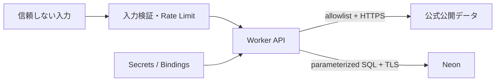

# 🔐 セキュリティ

## 🛡️ 信頼境界

## ⚠️ 主な脅威と対策

| 脅威           | 制御                                                        |
| -------------- | ----------------------------------------------------------- |
| SSRF           | URLテンプレート、host/IP/redirect allowlist、private IP拒否 |
| SQL injection  | Zod、パラメータ化SQL、識別子allowlist                       |
| Secret漏えい   | Worker Secret/Binding、secret scan、ログredaction           |
| 位置情報漏えい | 明示許可、既定非保存、ログは粗いtile/geohash                |
| CSV式注入      | `= + - @`等を無害化                                         |
| XSS            | HTML無効のMarkdown、CSP、出力escape                         |
| DoS/コスト増   | 面積・点数・byte・time上限、Rate Limit、cache               |
| 誤判定         | UNKNOWN優先、欠損明示、総合危険度を作らない                 |

## 🔑 認可

| Role        | 分析 | 保存 | ソース設定 | 監査 |
| ----------- | :--: | :--: | :--------: | :--: |
| Anonymous   | 制限 |  -   |     -      |  -   |
| Viewer      |  ✓   |  -   |     -      |  -   |
| Analyst     |  ✓   |  ✓   |     -      |  -   |
| DataAdmin   |  ✓   |  ✓   |     ✓      | 読取 |
| SystemAdmin |  ✓   |  ✓   |     ✓      |  ✓   |

限定検証ではCloudflare Access JWTをWorker側で検証し、UI表示だけに依存しません。

## 🔎 CIセキュリティゲート

`.github/workflows/security.yml` がPR・main pushで以下を強制する（検出時ジョブ失敗）。

| 観点                 | ツール          | 実行方法                                            |
| -------------------- | --------------- | --------------------------------------------------- |
| Secret混入           | gitleaks 8.30.1 | 全git履歴+作業ツリーを走査。設定は `.gitleaks.toml` |
| SAST（脆弱パターン） | semgrep 1.171.0 | `p/typescript` `p/javascript` `p/react` `p/secrets` |
| 依存関係の既知脆弱性 | pnpm audit      | `ci.yml` の `--audit-level=high`                    |

本リポジトリは private のため GitHub Advanced Security（CodeQL / native secret scanning）は課金対象で未有効化。有効化は人間決裁事項とし、それまでは上記 GHAS 非依存の OSS で代替する。報告窓口は [`SECURITY.md`](../SECURITY.md) を正本とする。

## ✅ リリース前チェック

- [ ] Critical/Highの依存関係・SAST・secret指摘が0
- [ ] CSP、nosniff、frame-ancestors、Referrer/Permissions Policyを確認
- [ ] SSRF allowlistとredirect/private-host拒否テストが成功
- [ ] Authorization、Cookie、JWT、DB URL、精密座標がログにない
- [ ] 権限境界をAPIテストで確認
- [ ] インシデント連絡先とSecretローテーション手順を確定

脆弱性の報告窓口は [`SECURITY.md`](../SECURITY.md) に定義済み（GitHub Security Advisories による非公開報告）。
