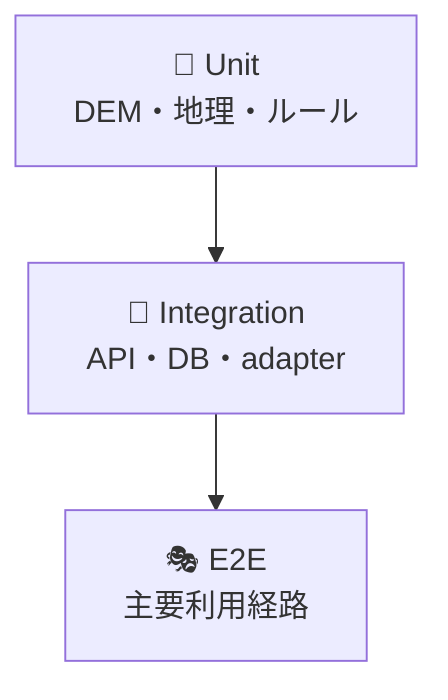

# ✅ テスト・品質戦略

## 🔺 テストピラミッド

## 🧪 必須試験

| 対象         | 重要ケース                    |
| ------------ | ----------------------------- |
| DEM decode   | 0m、正/負標高、無効値         |
| Mosaic       | 優先順、混在、全欠損、境界    |
| XYZ          | 日付変更線、赤道、高緯度、端  |
| Horn         | 平面、既知勾配、欠損近傍      |
| Profile      | 上昇、下降、欠損、点数上限    |
| Rule         | 閾値前/一致/超過、UNKNOWN優先 |
| セキュリティ | SSRF、認可、式注入、流量制限  |

## 🥇 ゴールデンデータ

CI必須試験は公開タイルへ直接依存せず、小さなDEM PNG fixtureと期待配列を使用します。fixtureには出典、取得日、利用可否、checksumを記録します。実サービスとの契約試験は低頻度の夜間ジョブへ分離します。

## 🚦 品質ゲート

- format / lint / TypeScript strict
- unit / integration / E2E smoke
- 主要計算の単体テスト網羅率80%以上
- OpenAPI lintと破壊的変更検出
- migration dry-runと復元手順
- secret / dependency / license scan
- build sizeとアクセシビリティsmoke

## 📋 受入

欠損や外部停止を安全扱いしないこと、全出力に出典・条件・版・免責が含まれること、同一条件の再現性があることを最優先で検証します。テスト失敗時は完了・merge・Done移動を禁止します。
