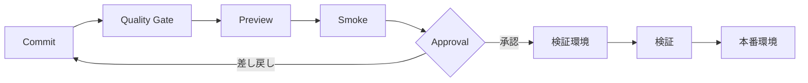

# 🚀 デプロイ・リリース

> 状態: 設計済み・環境未構築

## 🌍 環境

| 環境       | データ                       | DB              | 入口      |
| ---------- | ---------------------------- | --------------- | --------- |
| local      | fixture優先                  | mock / Neon dev | localhost |
| preview    | fixture + 制限付き公開データ | PR branch候補   | 一時URL   |
| staging    | 承認済み公開データ           | staging         | Access    |
| production | 承認済みソース               | production      | 別途判定  |

## 🔁 パイプライン

## 📦 リリース手順

1. 要件ID、変更、migration、運用影響を確認
2. 全品質ゲートとセキュリティ確認を通過
3. Previewで主要経路、外部停止、欠損表示を確認
4. stagingへデプロイしSLO・DB migration・復元可能性を確認
5. 承認後のみproductionへ昇格
6. version、commit、設定版、データ版を記録

## ↩️ ロールバック

- Worker/Webは直前の検証済みdeploymentへ戻す
- DBは後方互換migrationを優先し、破壊変更はexpand/contractで行う
- 設定はlast-known-goodへ戻す
- データソース異常はソース単位で隔離する

Cloudflare/Neonの実コマンド、account ID、binding名は環境構築後に追記し、秘密値は記載しません。
