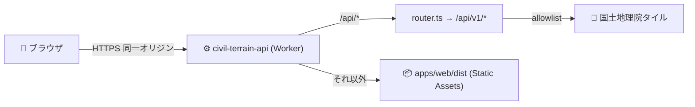
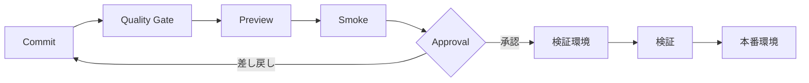

# 🚀 デプロイ・リリース

> 状態: 現行MVP（地図 + 単点標高）は**デプロイ配線済み・人間実行待ち**。Neon本番は分析機能着手時まで延期。

## 🌍 環境

| 環境       | データ                       | DB              | 入口      |
| ---------- | ---------------------------- | --------------- | --------- |
| local      | fixture優先                  | mock / Neon dev | localhost |
| preview    | fixture + 制限付き公開データ | PR branch候補   | 一時URL   |
| staging    | 承認済み公開データ           | staging         | Access    |
| production | 承認済みソース               | production      | 別途判定  |

## 🏗️ 現行MVPの本番構成（統合Worker + Static Assets）

現行MVP（地図表示 + `GET /api/v1/elevation`）は **1つのCloudflare Worker** で
SPA と API を**同一オリジン**配信します。



- **同一オリジン**のため **CORSは不要**、Pagesプロジェクトも不要（Cloudflareリソースは Worker 1つ）。
- ルーティングは `apps/api/wrangler.toml` の `[assets]` が制御する:
  - `run_worker_first = ["/api/*"]` → `/api/*` は必ずWorker（`router.ts` が `/api/v1/*` を処理）。
  - それ以外はSPA静的配信。未一致のクライアントルートは `not_found_handling =
"single-page-application"` で `index.html` にフォールバック。
- **現行MVPはDB非依存**（`/elevation` はDBを参照しない。DBを見るのは `/health/ready`
  の設定チェックのみ）。したがって**本番デプロイにNeon・secretは不要**。

> ⚠️ Neon（PostgreSQL）本番プロビジョニングは、地形分析・確認支援などDBを使う機能に
> 着手する時点（Sprint 3+）まで延期します。それまで `/health/ready` は「DB未接続」を
> 正しく 503 で表明します（下記ヘルスチェック参照）。

## 🔐 事前準備（人間が一度だけ実施する provisioning）

秘密値はここに記載しません。以下はCTO代行では自動実行しない**人間決裁・人間実行**の操作です。

1. Cloudflareアカウントを特定し `wrangler login`（またはCI用に `CLOUDFLARE_API_TOKEN` を
   安全に設定）。対象アカウントは1つに一意特定すること。
2. 初回 `wrangler deploy` により Worker `civil-terrain-api` が作成される（新規リソース作成＝
   人間承認事項）。カスタムドメインを使う場合のみ Cloudflare 側でルート/ドメインを設定する
   （DNS変更は人間決裁）。
3. **secretは現行MVPでは不要**。将来 `CF_ACCESS_TEAM_DOMAIN` / `CF_ACCESS_AUD`（限定検証）
   や `DATABASE_URL`（Neon接続、Hyperdrive推奨）を使う際に `wrangler secret put <NAME>` で
   登録する（値の登録・変更は人間決裁）。

## 📦 デプロイ手順（人間実行）

```bash
# 0) 事前検証（アップロードなし。CIの "Workers bundle check" と同じ dry-run）
pnpm --filter ./apps/web run build          # SPAを apps/web/dist へ生成（assetsの実体）
pnpm --filter ./apps/api exec wrangler deploy --dry-run --outdir /tmp/wrangler-bundle

# 1) 本番デプロイ（SPAビルド → Worker+Assetsを一括アップロード）
pnpm deploy
#   = pnpm --filter ./apps/web run build
#     && pnpm --filter ./apps/api exec wrangler deploy
```

- `pnpm deploy` は **SPAを先にビルド**してから `wrangler deploy` を実行する
  （`[assets].directory = ../web/dist` が存在している必要があるため）。
- 本番ビルドは `VITE_API_BASE_URL` を**設定しない**こと。未設定なら相対 `/api/v1` に
  フォールバックし、同一オリジンのWorkerへ届く（`.env.example` 参照）。
- Worker のコード・設定を変えずSPAだけ更新する場合も `pnpm deploy` を使う（assetsは
  Workerデプロイに同梱されるため）。

## ✅ デプロイ後スモーク（read-only）

| 確認                                         | 期待                                                                    |
| -------------------------------------------- | ----------------------------------------------------------------------- |
| `GET /`                                      | 200・SPAのindex.htmlが返る                                              |
| 任意のクライアントルート（例 `/foo`）        | 200・index.htmlにフォールバック（SPA）                                  |
| `GET /api/v1/health/live`                    | 200 `{"status":"ok"}`（プロセス生存。依存を見ない）                     |
| `GET /api/v1/health/ready`                   | **DB未接続なら 503**（UPSTREAM_UNAVAILABLE）。これは正常。DB接続後に200 |
| `GET /api/v1/elevation?lat=35.68&lon=139.76` | 200・標高/出典/品質、または欠損時 404(NO_COVERAGE)/503                  |

> 監視・稼働判定には **`/health/live`（200）** を使う。`/health/ready` は依存準備状況の
> 表明であり、DB未接続の現行MVPでは 503 が正しい（「未接続を安全と丸めない」原則）。

## ↩️ ロールバック

```bash
# 直前の検証済みバージョンへ戻す（Cloudflareが保持するデプロイ履歴を利用）
pnpm --filter ./apps/api exec wrangler rollback        # 直前へ
pnpm --filter ./apps/api exec wrangler deployments list # 履歴・ID確認
```

- Worker/SPAは同一デプロイ単位のため、`wrangler rollback` でSPAとAPIが同時に戻る。
- DBは後方互換migrationを優先し、破壊変更はexpand/contractで行う（現行MVPはDB変更なし）。
- 設定はlast-known-goodへ戻す。データソース異常はソース単位で隔離する。
- ロールバック後は無制限な再デプロイを行わず、原因・影響・現在稼働状態を記録する。

## 🔁 パイプライン（全体像）



## 📋 リリース手順（一般）

1. 要件ID、変更、migration、運用影響を確認
2. 全品質ゲートとセキュリティ確認を通過
3. Previewで主要経路、外部停止、欠損表示を確認
4. stagingへデプロイしSLO・DB migration・復元可能性を確認
5. 承認後のみproductionへ昇格
6. version、commit、設定版、データ版を記録

Cloudflareのaccount ID・binding名・カスタムドメインは環境構築後に追記し、秘密値は記載しません。
