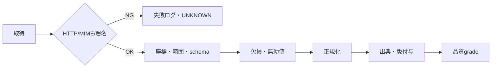
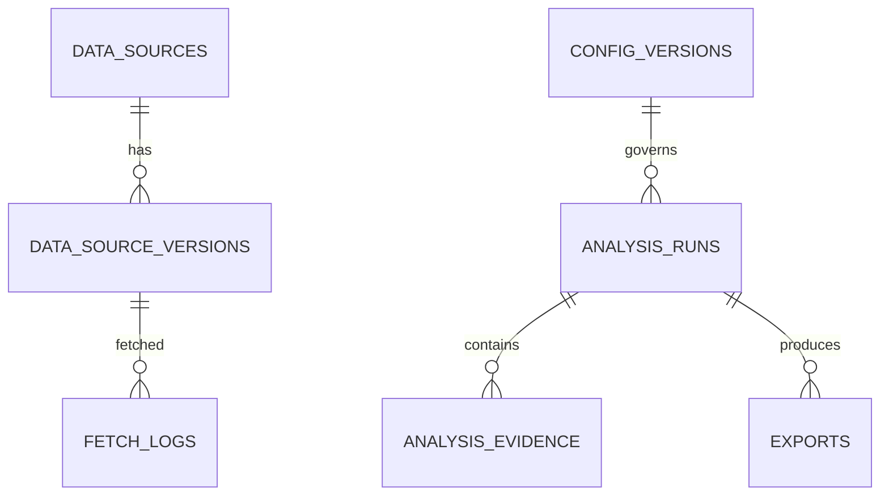

# 🗃️ データ設計

## 🌐 データソース

| 優先 | データ | 用途 |
| --- | --- | --- |
| 1 | GSI DEM1A/5A/5B/5C/10B | 標高・傾斜・断面 |
| 1 | GSI傾斜量図 | 視覚確認 |
| 1 | GSI陰影起伏図 | 起伏確認 |
| 1 | GSI地形分類ベクトル | 崖・谷・低地等 |
| 2 | 国土数値情報等 | 将来の公式ハザード補完 |
| 3 | OpenStreetMap | 補助地物・検索補完 |

## 🧹 処理パイプライン

DEMは `1A → 5A → 5B → 5C → 10B` の順に有効セルを採用し、source mixを保存します。負標高は有効値、`2^23`は欠損です。傾斜は3×3 Horn法で算出し、タイル境界では周囲1セル以上を取得します。

## 🗄️ 論理データモデル

主要エンティティはデータソース台帳、版、分析実行、証拠、取得ログ、設定版、出力です。PostGISが利用できない環境ではGeoJSONと数値列へフォールバックします。

## ⏳ 保持期間

| データ | 既定 |
| --- | ---: |
| アクセスログ | 30日 |
| 外部取得ログ | 90日 |
| 分析結果 | 90日 |
| 監査ログ | 1年 |
| 障害ログ | 180日 |

契約・法務・情報セキュリティ確認後に本番値を確定します。匿名分析は既定非保存とし、期限切れ削除を小分けで監査可能に実行します。

## ©️ 帰属

画面・共有・出力に提供元、URL、取得日時、解像度、加工方法、利用規約URLを表示します。規約変更時は自動継続せず、DataAdminの確認後に有効化します。
