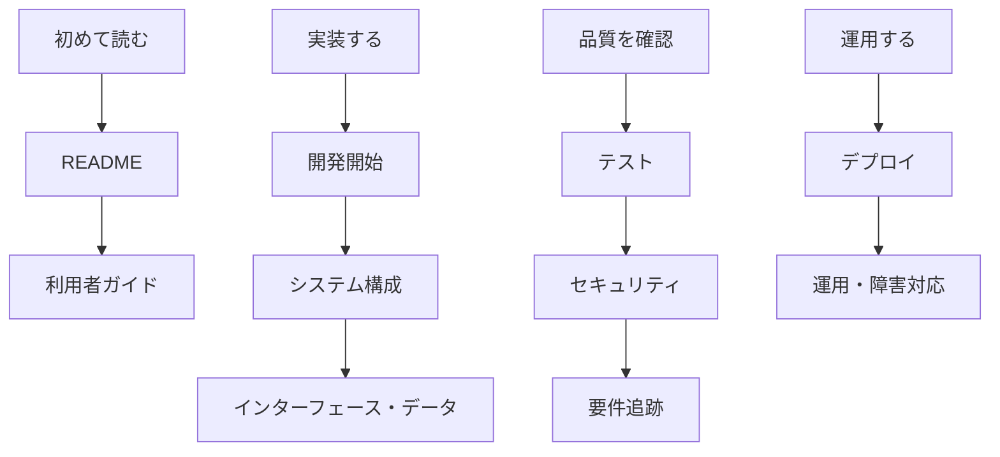

# 📚 ドキュメントセンター

> 最終更新: 2026-07-16 / 対象文書版: 1.0.0

## 🧭 読み方

## 📖 文書一覧

| 分類 | 文書                                                               | 目的                                    |
| ---- | ------------------------------------------------------------------ | --------------------------------------- |
| 概要 | [README](../README.md)                                             | 目的、状態、全体像                      |
| 原典 | [要件定義書](../地形傾斜リスク可視化システム要件定義書.md)         | 何を、なぜ、どこまで作るか              |
| 原典 | [詳細設計仕様書](../地形傾斜リスク可視化システム詳細設計仕様書.md) | どのように作るか                        |
| 導入 | [開発開始ガイド](開発開始ガイド.md)                                | 実装開始前後の手順                      |
| 利用 | [利用者ガイド](利用者ガイド.md)                                    | 想定操作と結果の読み方                  |
| 設計 | [アーキテクチャ](アーキテクチャ.md)                                | 構成、責務、データフロー                |
| 設計 | [インターフェース仕様](インターフェース仕様.md)                    | REST契約とエラー                        |
| 設計 | [データ設計](データ設計.md)                                        | 公開データ、DEM、DB、保持               |
| 設計 | [AI支援機能設計書](AI支援機能設計書.md)                            | AI活用のユースケース・監査・予算・停止  |
| 管理 | [ライセンスとOSS方針](ライセンスとOSS方針.md)                      | ライセンス決定待ち事項とデータ帰属      |
| 品質 | [セキュリティ](セキュリティ.md)                                    | 脅威、制御、確認項目                    |
| 品質 | [テスト品質戦略](テスト品質戦略.md)                                | テスト戦略と品質ゲート                  |
| 画面 | [画面設計とアクセシビリティ](画面設計とアクセシビリティ.md)        | 状態表現、操作性、WCAG                  |
| 運用 | [デプロイとリリース](デプロイとリリース.md)                        | 環境、リリース、ロールバック            |
| 運用 | [運用と障害対応](運用と障害対応.md)                                | SLO、監視、障害、復旧                   |
| 計画 | [ロードマップ](ロードマップ.md)                                    | スプリントと完了条件                    |
| 管理 | [要件トレーサビリティ](要件トレーサビリティ.md)                    | 要件から成果物・試験への追跡            |
| 管理 | [ガバナンスとプライバシー](ガバナンスとプライバシー.md)            | プライバシー、KPI、リスク、リリース判定 |
| 開発 | [開発参加ガイド](開発参加ガイド.md)                                | ブランチ、PR、完了条件                  |
| 補助 | [よくある質問と用語集](よくある質問と用語集.md)                    | よくある質問と用語                      |
| 判断 | [設計判断記録一覧](設計判断記録/設計判断記録一覧.md)               | 重要な設計判断の記録                    |

## 🏷️ 文書ステータス

- `規範`: 要件定義書・詳細設計仕様書。矛盾時はこの順に確認する。
- `運用化`: 本docs群。実装に合わせて継続更新する。
- `未確定`: 実装・契約・検証後に確定する項目は明示的にTBDとする。

## 🔄 更新ルール

コード変更時はREADMEだけでなく関連docs、要件ID、OpenAPI、テストも同じPRで更新します。事実と計画を混同せず、未実装機能には必ず「計画」または「未実装」と記載します。
