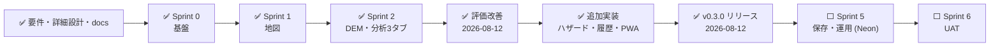

# 🗺️ ロードマップ

## 📍 現在地

## 🧱 スプリント別成果

| スプリント | 成果                          | 完了条件             |
| ---------- | ----------------------------- | -------------------- |
| 0          | monorepo、CI、fixture、台帳   | offline test安定     |
| 1          | MapLibre、GSIレイヤー、帰属   | 地図E2E成功          |
| 2          | DEM decode、単点標高、品質    | 負標高・欠損成功     |
| 3          | Mosaic、Horn、周辺統計        | 境界試験成功         |
| 4          | 断面、地形分類、カード        | 根拠紐付け100%       |
| 5          | Neon、履歴、出力、監視        | 保存・復旧・縮退成功 |
| 6          | UAT、性能、セキュリティ、文書 | 重大不具合0          |

## ✅ 評価改善 (2026-08-12)

| 項目             | 内容                                                                                           | 状態                |
| ---------------- | ---------------------------------------------------------------------------------------------- | ------------------- |
| レポート出力     | Markdown / CSV / JSON をクライアントサイド生成で実装 (出典・判定不能・CSV式注入対策込み)       | ✅ 実装・テスト済み |
| APIセキュリティ  | スライディングウィンドウ式レート制限 (429+Retry-After) / Access JWTのWorker側検証 (設定時のみ) | ✅ 実装・テスト済み |
| API契約          | `GET /capabilities`・`GET /sources` を実装 (OpenAPI 3.1準拠)                                   | ✅ 実装・テスト済み |
| 品質ゲート       | カバレッジ計測をCI化 (80%閾値、実測93%)                                                        | ✅ 設定済み         |
| 性能             | MapLibre遅延読み込み + ベンダーチャンク分割 (初期JS 1.26MB→約205KB)                            | ✅ ビルド検証済み   |
| アクセシビリティ | スキップリンク / prefers-reduced-motion / タッチターゲット44px                                 | ✅ 実装済み         |
| 監査・運用       | GitHubリポジトリ復旧 (push/CI再開) → PR #1〜#3マージ・本番デプロイ v0.2.1 済み                 | ✅ 完了             |

## ✅ 追加実装 (2026-08-12 第2弾)

| 項目                 | 内容                                                                                    | 状態                |
| -------------------- | --------------------------------------------------------------------------------------- | ------------------- |
| 公式ハザードレイヤー | 重ねるハザードマップ「土砂災害警戒区域」3種 (土石流/急傾斜地/地すべり) を重ね合わせ表示 | ✅ 実装・テスト済み |
| 分析履歴・比較       | クライアント保存 (localStorage 最大30件)・一覧・開く・削除・2地点の項目別比較           | ✅ 実装・テスト済み |
| PWA/オフライン       | manifest・アイコン・Service Worker (アプリシェルキャッシュ。API/タイルは非キャッシュ)   | ✅ 実装・テスト済み |
| ライセンス・AI設計   | ライセンス方針 (決定待ち) とAI支援機能設計書 (実装未着手) を追加                        | ✅ 文書化           |
| v0.3.0 リリース      | PR #4 マージ → CI全成功 (E2E 9/9) → 本番デプロイ (Version 8437425b) → タグ/Release 作成 | ✅ 完了             |

## 🔮 MVP後

- 残りの公式ハザード (洪水・高潮・津波等) の重畳
- 3D地形、等高線、集水域・流向、任意ポリゴン統計
- PDF、GeoJSON、GeoPackage出力
- Civil Open Data Intelligence Platform / モバイル連携
- AI支援 (RAG・構造化抽出・異常検知) — 設計書は docs/AI支援機能設計書.md

リリース期は新機能を入れず、セキュリティ、データ破損、リリース阻害だけを例外対応します。
