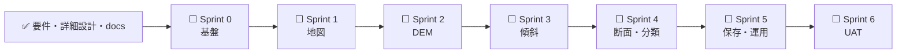

# 🗺️ ロードマップ

## 📍 現在地

## 🧱 スプリント別成果

| スプリント | 成果                          | 完了条件             |
| ---------- | ----------------------------- | -------------------- |
| 0          | monorepo、CI、fixture、台帳   | offline test安定     |
| 1          | MapLibre、GSIレイヤー、帰属   | 地図E2E成功          |
| 2          | DEM decode、単点標高、品質    | 負標高・欠損成功     |
| 3          | Mosaic、Horn、周辺統計        | 境界試験成功         |
| 4          | 断面、地形分類、カード        | 根拠紐付け100%       |
| 5          | Neon、履歴、出力、監視        | 保存・復旧・縮退成功 |
| 6          | UAT、性能、セキュリティ、文書 | 重大不具合0          |

## 🔮 MVP後

- 公式ハザードレイヤー（出典と地形観測を明確に分離）
- 3D地形、等高線、集水域・流向、任意ポリゴン統計
- PDF、GeoJSON、GeoPackage出力
- Civil Open Data Intelligence Platform / モバイル連携

リリース期は新機能を入れず、セキュリティ、データ破損、リリース阻害だけを例外対応します。
