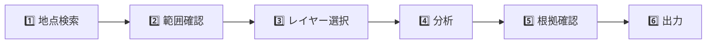

# 👤 利用者ガイド

> この文書は計画中のMVP操作を示します。Web UIはまだ実装されていません。

## 🧭 基本操作

1. 住所、座標、地図クリック、現在地のいずれかで地点を指定します。
2. 半径と対象範囲を確認します。
3. 標高、傾斜、陰影起伏、地形分類を切り替えます。
4. 周辺統計または任意線の断面を分析します。
5. 要確認カード、欠損率、採用DEM、出典を確認します。
6. Markdown、CSV、JSONで条件と根拠を出力します。

## ⚠️ 結果状態

| 表示        | 意味                             | 次の行動                   |
| ----------- | -------------------------------- | -------------------------- |
| ℹ️ 参考情報 | 公開データから確認できた地形情報 | 必要に応じて詳細調査       |
| ⚠️ 要確認   | 追加確認が必要な観測             | 現地踏査・測量・専門家確認 |
| ❔ 判定不能 | 欠損、範囲外、取得失敗           | 別データや現地で確認       |
| 🟡 PARTIAL  | 一部のみ分析可能                 | 欠損範囲と根拠を確認       |
| 🟢 COMPLETE | 要求範囲の分析完了               | 精度・限界を確認して利用   |

## 📈 断面図の読み方

断面は総延長、サンプル間隔、標高差、累積上昇・下降、平均・最大傾斜を表示します。欠損区間は補間せずグラフを切断します。最大傾斜だけで施工可否を判断しないでください。

## 🧾 出力前チェック

- 対象座標・半径・分析日時が正しい
- 出典、取得日時、データ版が含まれる
- 欠損率と品質gradeを確認した
- 加工注記と免責が含まれる
- 共有URLに住所、現在地履歴、自由記述などを入れていない
