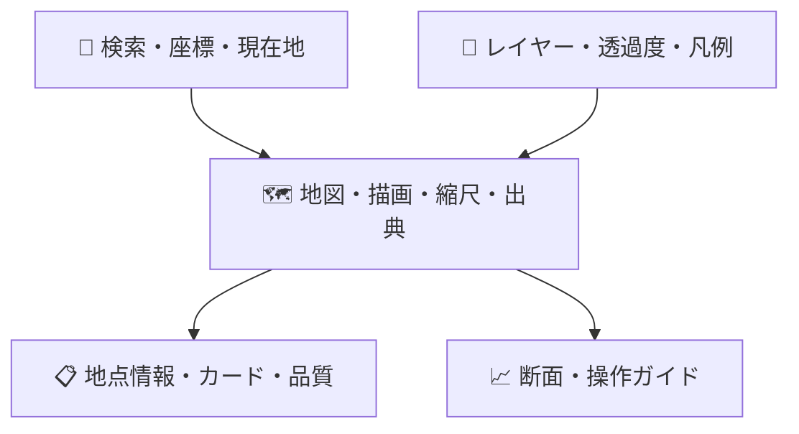

# ♿ UI・アクセシビリティ

## 🖥️ 画面構成

## 🎨 状態表現

| 状態     | アイコン | 文言            | 非色覚情報  |
| -------- | -------- | --------------- | ----------- |
| 参考     | ℹ️       | 参考情報        | 円形        |
| 要確認   | ⚠️       | 追加確認が必要  | 三角・太字  |
| 判定不能 | ❔       | データ不足/失敗 | 斜線pattern |
| 処理中   | ⏳       | 分析中          | progressbar |

色だけで意味を伝えず、文言・形・patternを併用します。赤は公式危険判定と誤認されないよう「初期確認」を常時併記します。

## ⌨️ WCAG 2.2 AA目標

- 地点検索、レイヤー、結果、出力をキーボードだけで操作可能
- フォーカスを視認可能にし、地図trapを避ける
- canvas地図に同等のテキスト結果と一覧を提供
- 断面グラフに表形式の代替情報を提供
- `prefers-reduced-motion`に対応
- 200% zoom、320 CSS px幅、最新iOS/iPadOS Safariを確認

## 📱 レスポンシブ

PCでは地図とサイドパネル、モバイルでは地図を主表示し結果をボトムシート化します。現在地の精度円を表示し、端末位置とDEM標高が別物であることを説明します。
