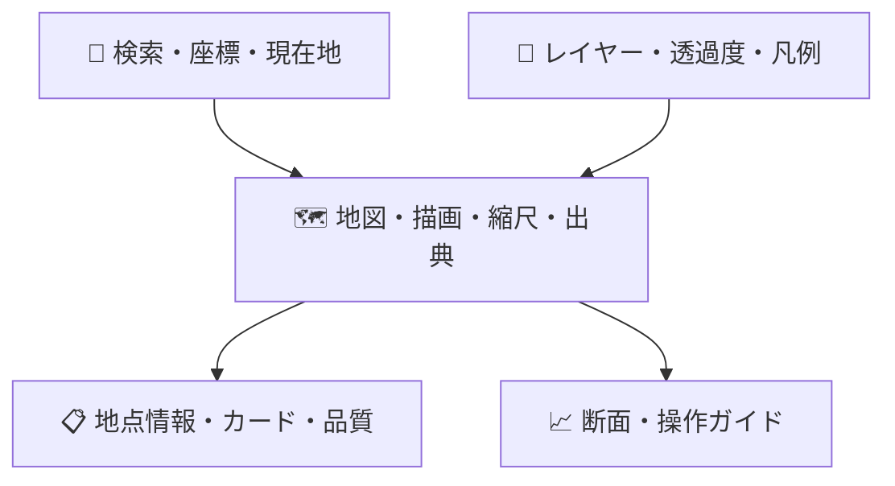

# ♿ UI・アクセシビリティ

## 🖥️ 画面構成

## 🎨 デザインシステム (Issue #23)

視覚デザインの正本は Claude Design プロジェクト「Slope Risk Viewer redesign」
(`Slope Risk Viewer (Redesign).dc.html`)。実装は `apps/web/src/app.css` の
`:root` CSS変数 (デザイントークン) に集約する。

| トークン群 | 内容                                                              |
| ---------- | ----------------------------------------------------------------- |
| Brand      | `--accent` #E08A2B (装飾・枠線・背景専用。小サイズテキスト禁止)   |
| Surfaces   | `--bg` / `--surface` / `--subtle` / `--line` 系                   |
| Text       | `--ink` / `--ink-2` / `--muted`                                   |
| Semantic   | `--blue` / `--green` / `--amber` / `--red` / `--purple` (+ `-bg`) |
| Shape/Type | `--radius` 10px / `--shadow` / `--mono` (IBM Plex Mono)           |

書体は IBM Plex Sans JP / IBM Plex Mono (Google Fonts、`display=swap`)。

**AA調整**: テキスト用途の 4 色はデザイン原値がコントラスト比 4.5:1 未満のため、
色相・彩度を保ち明度のみ暗くした (`--muted` #8A97A8→#627084、`--amber`
#B5701A→#9A5F16、`--green` #1F8255→#1E7C51、`--red` #C5392F→#C3382F)。

**意図的乖離**: デザイン内のモックデータ画面 (地形分析の数値・断面分析・
DEM取得ステータス・架空ユーザー) は実装しない。架空の値の表示は
「データなし ≠ 安全」の製品原則に反するため。該当機能は実データが
揃う後続Sprintで、このデザインをレイアウト正本として実装する。

## 🎨 状態表現

| 状態     | アイコン | 文言            | 非色覚情報  |
| -------- | -------- | --------------- | ----------- |
| 参考     | ℹ️       | 参考情報        | 円形        |
| 要確認   | ⚠️       | 追加確認が必要  | 三角・太字  |
| 判定不能 | ❔       | データ不足/失敗 | 斜線pattern |
| 処理中   | ⏳       | 分析中          | progressbar |

色だけで意味を伝えず、文言・形・patternを併用します。赤は公式危険判定と誤認されないよう「初期確認」を常時併記します。

## ⌨️ WCAG 2.2 AA目標

- 地点検索、レイヤー、結果、出力をキーボードだけで操作可能
- フォーカスを視認可能にし、地図trapを避ける
- canvas地図に同等のテキスト結果と一覧を提供
- 断面グラフに表形式の代替情報を提供
- `prefers-reduced-motion`に対応
- 200% zoom、320 CSS px幅、最新iOS/iPadOS Safariを確認

## 📱 レスポンシブ

PCでは地図とサイドパネル、モバイルでは地図を主表示し結果をボトムシート化します。現在地の精度円を表示し、端末位置とDEM標高が別物であることを説明します。
