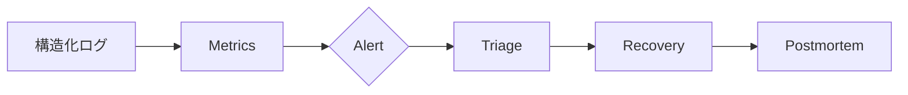

# 🛠️ 運用・障害対応

## 📊 SLI/SLO候補

| SLI           |     目標 | 警戒例        |
| ------------- | -------: | ------------- |
| API成功率     | 99.0%/月 | 5分で95%未満  |
| 地点分析p95   |  5秒以内 | 15分で8秒超   |
| GSI取得成功率 |      98% | 10分で90%未満 |
| DB接続失敗    | 0.5%未満 | 5分で2%超     |
| 出典表示率    |     100% | 1件でも欠落   |

## 📈 監視・アラート (2026-08-12 時点の実装状態)

| 項目                  | 状態      | 内容                                                                                                                                            |
| --------------------- | --------- | ----------------------------------------------------------------------------------------------------------------------------------------------- |
| Workers Observability | ✅ 有効   | `wrangler.toml` の `[observability] enabled = true`。ログ・トレースは Cloudflare ダッシュボードで参照可                                         |
| 構造化監査ログ        | ✅ 実装   | `apps/api/src/observability.ts`。アクセス許可・拒否・レート制限・内部エラーをJSON 1行で出力。PII (座標・メール・トークン) を含めない            |
| Workers Logs          | ✅ 有効   | 上記ログは Workers Logs へ到達する (ダッシュボードの Logs タブ)                                                                                 |
| アラートポリシー      | ⛔ 未設定 | 下記のポリシー定義は準備済み。**APIトークンに通知API権限がないため作成未実施**。Cloudflareダッシュボードまたは通知API権限付きトークンで作成する |

### 推奨アラートポリシー (未作成)

Cloudflare 通知 API (`POST /accounts/{account_id}/alerting/v3/alert_policies`) で
次を推奨する:

| ポリシー         | 種別                           | 条件                          | 通知先候補   |
| ---------------- | ------------------------------ | ----------------------------- | ------------ |
| Workers 5xx 率   | Workers Invocation Status Code | 5分で 5xx が 10% 超           | IT・DXメール |
| Workers エラー率 | Workers Usage / Invocations    | エラー回数が急増 (前日比 2倍) | IT・DXメール |
| 課金・コスト     | Workers Usage Reports          | 無料枠の 80% 到達             | 管理者       |
| GSI 取得成功率   | カスタム (Fetch Logs連携後)    | 10分で 90% 未満               | 管理者       |

設定コマンドの例はダッシュボードの「Notifications」から行うことを推奨 (トークン権限
確認が不要)。APIで作成する場合のペイロードは本ファイルに追記予定。

### 監査ログの運用

- 監査イベントは Workers Logs から `requestId`・`outcome`・`path` で検索できる。
- 保持期間: 監査ログ 1年 (DB接続後の `audit_logs` テーブルへ永続化。migration `0001_init.sql` 検証済み)。
- 監査ログに座標・メール・トークンを含めないことを CI テストで強制 (`observability.test.ts`)。

## 🔭 監視フロー

`request_id`、`source_key`、status、latency、cache、error_codeを記録し、Secret、JWT、完全IP、精密座標は記録しません。

## 🚨 ランブック

| 症状            | 初動                 | 縮退               | 復旧確認             |
| --------------- | -------------------- | ------------------ | -------------------- |
| DEM 5xx/timeout | source別成功率確認   | cached表示/UNKNOWN | 代表tileの低頻度確認 |
| 地形分類異常    | schema/MIME差分確認  | DEMのみPARTIAL     | adapter契約試験      |
| DB接続失敗      | ready/Hyperdrive確認 | 非保存分析         | read/write・整合確認 |
| 欠損率急増      | 地域/DEM版/境界確認  | 品質警告           | golden/代表地点比較  |
| 設定破損        | config version確認   | last-known-good    | readyとrule回帰試験  |

## ♻️ 定期作業

- 日次: 主要SLI、失敗上位、コスト、source状態
- 週次: dependency/security、欠損傾向、キャッシュ効率
- 月次: SLO、保持期限、アクセス権、規約変更
- 四半期: Neon復元試験、障害訓練、Runbook更新

## 🧾 インシデント記録

発生/検知/復旧時刻、影響、request ID、原因、暫定/恒久対策、再発防止テストを残します。未確認事項を推測で確定せず、外部提供元障害と自システム障害を分離します。
