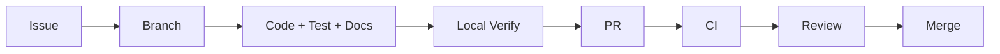

# 🤝 開発参加ガイド

## 🌱 原則

- 1変更1目的で小さくする
- 要件ID、Issue、実装、テスト、文書を追跡可能にする
- 公開データの規約と帰属を実装前に確認する
- `UNKNOWN`や欠損を0・安全へ変換しない
- 未検証変更をmergeしない

## 🔀 推奨フロー

ブランチ名の例: `feat/FR-006-point-elevation`、`fix/UT-DEM-01-negative-elevation`、`docs/api-errors`。

## 📝 PRに含めるもの

- 目的と関連要件ID
- 変更範囲と変更しない範囲
- テスト結果と再現コマンド
- セキュリティ、プライバシー、データ規約への影響
- UI変更ならスクリーンショットとアクセシビリティ結果
- API/DB変更ならOpenAPI、migration、rollback

## ✅ 完了条件

- [ ] 要件・受入条件を満たす
- [ ] format/lint/type/test/buildが成功
- [ ] 欠損・失敗・境界ケースを追加
- [ ] Secret・精密位置・個人情報を残さない
- [ ] README/docs/OpenAPIを更新
- [ ] Previewまたは相応の実行検証を完了

## 📐 コーディング方針

TypeScript strictを使用し、ドメイン計算をframeworkから分離します。外部I/Oはadapterへ閉じ込め、日時・乱数・fetchを注入可能にして再現性あるテストを作ります。
