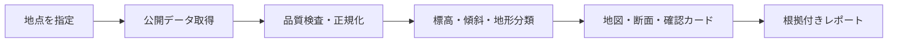
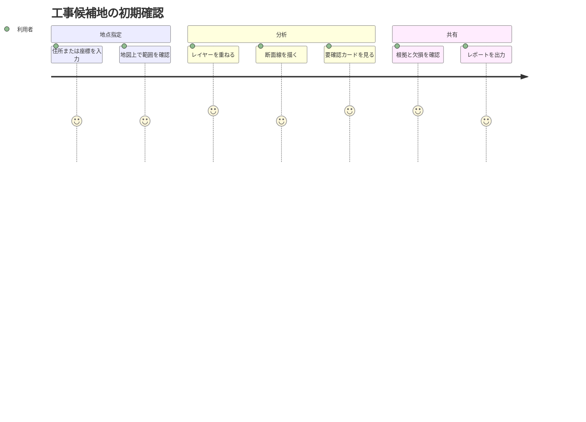
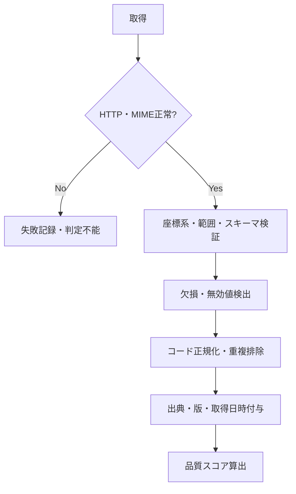
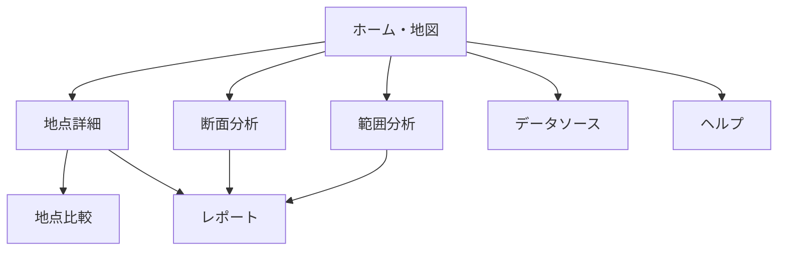
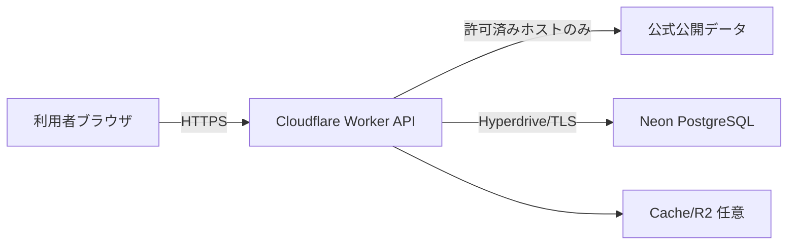
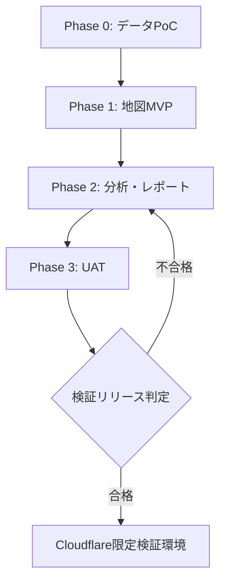

# Civil Terrain & Slope Risk Viewer 要件定義書

> 地形・傾斜リスク可視化システム  
> Repository: `Civil-Terrain-Slope-Risk-Viewer`  
> 文書版: 1.0.0 / 作成日: 2026-07-16 / 対象: MVP～検証環境

---

## 0. 文書の目的

本書は、指定地点周辺の標高、傾斜、谷地形、崖地、低地等を公開データから可視化し、土工・造成・仮設計画等の**初期確認を支援**するWebシステムについて、「何を、なぜ、どこまで実現するか」を定義する。

本システムは測量、地質調査、現地踏査、設計計算、法令上の判定、専門技術者の判断を代替しない。画面・出力には、必ずデータ出典、取得日時、解像度、整備範囲、欠損、推定・加工の有無を表示する。

---

## 1. プロジェクト概要

| 項目           | 内容                                                                                                                            |
| -------------- | ------------------------------------------------------------------------------------------------------------------------------- |
| 日本語名       | 地形・傾斜リスク可視化システム                                                                                                  |
| 英語名         | Civil Terrain & Slope Risk Viewer                                                                                               |
| GitHub候補     | `Civil-Terrain-Slope-Risk-Viewer`                                                                                               |
| 目的           | 工事候補地周辺の地形特性と要確認事項を短時間で把握する                                                                          |
| 主利用者       | 現場管理者、施工計画担当、土木技術者、調査担当、研究者、IT・DX担当                                                              |
| 利用データ     | 国・自治体等が提供する公開データ、公開API、ローカル検証データ                                                                   |
| 利用しない情報 | AD、Entra ID、HENNGE ONE、SharePoint、DirectCloud、FortiGate、DeskNet's NEO、社内ファイルサーバ、案件台帳等の会社資産・社内情報 |
| 開発・検証基盤 | Claude Code on Linux、GitHub、Cloudflare、Neon PostgreSQL                                                                       |
| 製品位置付け   | 調査入口・初期検討支援。確定判定システムではない                                                                                |

### 1.1 背景

土工、造成、仮設ヤード、搬入路等の初期検討では、標高差、急傾斜、谷状地形、崖・段丘崖、低地等を複数サイトで確認する必要がある。情報が分散しているため、調査時間、見落とし、根拠の共有に課題がある。

本システムは公開情報を同一地図上に整理し、**現地調査や専門確認に進むための論点を早く揃える**ことを狙う。

### 1.2 期待効果

- 🗺️ 指定地点周辺の地形情報を一画面で確認できる
- ⛰️ 標高差・傾斜分布・断面を視覚的に把握できる
- ⚠️ 谷、崖、低地等の「追加確認候補」を根拠付きで抽出できる
- 🧾 調査条件とデータ出典を含むレポートを再現可能にする
- 🔌 Civil Open Data Intelligence Platform等の後続基盤とAPI連携しやすくする

---

## 2. スコープ

### 2.1 MVPの対象

1. 住所、緯度経度、地図クリック、端末現在地による地点指定
2. 標高、傾斜量、陰影起伏、地形分類の表示
3. 任意線の標高断面図、標高差、平均・最大傾斜の算出
4. 指定半径内の地形分類と傾斜区分の集計
5. 谷・凹地、崖・段丘崖、低地、地すべり地形等の要確認候補表示
6. 出典、取得日時、データ種別、解像度、欠損率、加工方法の表示
7. 共有URL（非機密の検索条件のみ）とMarkdown/CSV/JSON出力
8. データ取得ログ、失敗ログ、分析条件、結果スナップショットの保存
9. レスポンシブWeb対応（PC優先、スマートフォン・タブレット閲覧対応）

### 2.2 MVP対象外

- 測量成果、設計成果、施工可否、安定計算、安全率の確定
- 切土・盛土量の正式数量計算
- 地質、地下水、支持層、土質定数の推定
- 法令、条例、土砂災害警戒区域等の行政判断の代行
- リアルタイム災害監視、避難判断、アラート配信
- 社内案件情報・個人情報・写真・図面の登録
- 自動生成した結果のみを根拠とする意思決定
- iOSネイティブアプリ（Web APIは将来連携を考慮）

### 2.3 将来拡張

- 土砂災害警戒区域、洪水・高潮・津波等の公式ハザードレイヤー
- 3D地形、等高線、集水域・流向解析、任意ポリゴン統計
- Civil Field Risk Pocket / iOSアプリ連携
- Civil Open Data Intelligence Platformのデータカタログ連携
- PDFレポート、GeoJSON/GeoPackage出力
- Cloudflare Accessによる限定公開（会社情報を扱う段階で別途審査）

---

## 3. 利用者と利用シナリオ

| ペルソナ     | 主な目的                       | 必要な表示                       |
| ------------ | ------------------------------ | -------------------------------- |
| 現場管理者   | 現地周辺の高低差と急傾斜を把握 | 現在地、傾斜色分け、確認カード   |
| 施工計画担当 | 仮設ヤード・搬入路候補を比較   | 断面図、標高差、比較結果         |
| 土木技術者   | 調査・設計前の論点整理         | データ品質、地形分類、根拠URL    |
| 研究者       | 地形特性の探索                 | レイヤー、集計、CSV/JSON         |
| IT・DX担当   | データ/APIと運用品質を管理     | データソース台帳、取得ログ、監視 |

### 3.1 代表ユースケース

---

## 4. 業務要件

| ID    | 要件                                      | 優先度 | 完了条件                              |
| ----- | ----------------------------------------- | ------ | ------------------------------------- |
| BR-01 | 地点から周辺地形を5分以内に初期確認できる | Must   | 初見利用者がガイド付きで完了          |
| BR-02 | 表示結果ごとに根拠を追跡できる            | Must   | 出典・取得日時・加工方法が表示される  |
| BR-03 | 欠損・範囲外をリスクなしと誤認させない    | Must   | 「判定不能」「データなし」を明示      |
| BR-04 | 同じ条件で分析を再現できる                | Must   | 条件・データ版・アルゴリズム版を保存  |
| BR-05 | 専門判断を代替しない                      | Must   | 免責と追加確認先を常時表示            |
| BR-06 | 会社資産なしで検証できる                  | Must   | 公開・サンプルデータのみでE2E試験可能 |
| BR-07 | 将来のモバイル/API利用に備える            | Should | UIとAPIを分離しOpenAPIを管理          |

---

## 5. 機能要件

### 5.1 機能一覧

| ID     | 機能         | 概要                                        | 優先度 |
| ------ | ------------ | ------------------------------------------- | ------ |
| FR-001 | 地点検索     | 住所、座標、地図クリック、現在地            | Must   |
| FR-002 | 検索入力検証 | 日本域、座標形式、半径、文字数を検証        | Must   |
| FR-003 | ベースマップ | 標準地図、淡色地図、写真等を切替            | Must   |
| FR-004 | 地形レイヤー | 陰影起伏、傾斜量、地形分類等を重畳          | Must   |
| FR-005 | 透過度・凡例 | レイヤーごとの表示、透過度、凡例            | Must   |
| FR-006 | 地点標高     | クリック地点の標高とデータソースを表示      | Must   |
| FR-007 | 周辺統計     | 半径内の最小/最大/平均標高、標高差、欠損率  | Must   |
| FR-008 | 傾斜区分     | 0–5、5–15、15–30、30–45、45度以上を既定表示 | Must   |
| FR-009 | 断面描画     | 任意線を描画し標高プロファイルを作成        | Must   |
| FR-010 | 断面統計     | 距離、累積上昇/下降、最大/平均傾斜を表示    | Must   |
| FR-011 | 地形分類照会 | 地形コード、名称、成り立ち、一般的留意点    | Must   |
| FR-012 | 要確認カード | 崖・谷・低地等を根拠と距離付きで表示        | Must   |
| FR-013 | 品質表示     | 整備範囲、解像度、更新・取得時刻、欠損率    | Must   |
| FR-014 | 比較         | 2～4地点の主要指標を比較                    | Should |
| FR-015 | 共有URL      | 座標・表示条件をURL化。個人情報は禁止       | Should |
| FR-016 | 出力         | Markdown、CSV、JSON形式                     | Must   |
| FR-017 | データ台帳   | ソースURL、規約、帰属、状態、優先順位       | Must   |
| FR-018 | 取得ログ     | 成否、HTTP状態、遅延、キャッシュ、欠損      | Must   |
| FR-019 | 管理画面     | データソース健全性、エラー、設定版を表示    | Should |
| FR-020 | ヘルプ       | 用語、凡例、限界、現地確認事項              | Must   |

### 5.2 確認カードの区分

確認カードは「危険」「安全」の断定ではなく、`要確認`、`参考情報`、`判定不能`で表現する。

| カテゴリ     | 主根拠                       | 表示例                                                      |
| ------------ | ---------------------------- | ----------------------------------------------------------- |
| 急傾斜       | DEMから算出した傾斜          | 「指定範囲に30°以上のセルを確認。現地測量と斜面条件を確認」 |
| 崖・段丘崖   | 地形分類コード               | 「崖・段丘崖分類まで約80m。境界精度に留意」                 |
| 谷・凹地     | 凹地・浅い谷、谷底平野等     | 「雨水が集まりやすい地形分類を確認」                        |
| 低地         | 氾濫平野、後背低地、旧河道等 | 「低地分類を確認。公式ハザード情報を別途確認」              |
| 地すべり地形 | 地形分類                     | 「地すべり地形分類を確認。専門調査を推奨」                  |
| データ品質   | 欠損、範囲外、低解像度       | 「高解像度DEMなし。結果を確定判断に使用しない」             |

---

## 6. データ要件

### 6.1 採用データ

| 優先 | データ                                      | 用途               | 取扱方針                                     |
| ---- | ------------------------------------------- | ------------------ | -------------------------------------------- |
| 1    | 国土地理院 標高タイル（DEM1A/5A/5B/5C/10B） | 標高・傾斜・断面   | PNG形式を優先し、利用可能な最良ソースを選択  |
| 1    | 国土地理院 傾斜量図                         | 視覚確認           | 表示用。数値評価はDEMから再計算              |
| 1    | 国土地理院 陰影起伏図                       | 起伏の視覚確認     | 表示用                                       |
| 1    | 国土地理院 ベクトルタイル「地形分類」       | 崖・谷・低地等     | コード、原典、注意事項を保持                 |
| 2    | 国土数値情報等の公式公開データ              | 将来のハザード補完 | データ別の利用条件を審査後に追加             |
| 3    | OpenStreetMap                               | 補助地物・検索補完 | 帰属表示・利用ポリシー順守。必須依存にしない |

### 6.2 データクレンジング

- 座標系は外部I/OをWGS 84（EPSG:4326）、Web地図表示をWeb Mercator（EPSG:3857）とする。
- `e`、PNG無効値、空ジオメトリ、範囲外、異常標高を欠損として扱う。
- 複数DEMが利用可能な場合は 1A → 5A → 5B → 5C → 10B の優先順を基本とし、実際に採用したソースをセル/分析単位で記録する。
- タイル境界を跨ぐ傾斜計算では周辺1セル以上を取得し、境界アーティファクトを防ぐ。
- 地形分類の重複は消去せず、原典・コード・優先順位を保持する。
- データなしを0m、平坦、安全に置換しない。

### 6.3 帰属・利用条件

- 画面、出力、共有結果に出典を表示する。
- 加工結果には「地理院タイルを加工して作成」等、加工した旨を表示する。
- データソース台帳に利用規約URL、確認日、必須表記、再配布可否、キャッシュ条件を記録する。
- 規約または提供仕様が変更されたデータソースは自動的に採用せず、管理者レビュー後に有効化する。

---

## 7. 画面要件

| ID     | 画面         | 主な構成                                 |
| ------ | ------------ | ---------------------------------------- |
| SCR-01 | ホーム/地図  | 検索、地図、レイヤー、凡例、現在地、免責 |
| SCR-02 | 地点詳細     | 標高、地形分類、要確認カード、データ品質 |
| SCR-03 | 断面分析     | 線描画、断面グラフ、統計、欠損表示       |
| SCR-04 | 範囲分析     | 半径/ポリゴン、標高・傾斜・分類集計      |
| SCR-05 | 地点比較     | 最大4地点の指標・品質比較                |
| SCR-06 | レポート     | 条件、地図、結果、根拠、注意事項、出力   |
| SCR-07 | データソース | 台帳、健全性、利用条件、更新履歴         |
| SCR-08 | ヘルプ       | 操作、用語、凡例、限界、問い合わせ       |

### 7.1 画面遷移

### 7.2 UI原則

- 色だけで状態を伝えず、文言・アイコン・パターンを併用する。
- 赤色は公的な危険判定と誤解されないよう、凡例と「初期確認」を併記する。
- 地図上の常設領域に出典、縮尺、取得条件を表示する。
- スマートフォンでは地図を主表示し、結果パネルをボトムシート化する。
- 主要操作はキーボードでも利用可能とし、WCAG 2.2 AA相当を目標とする。

---

## 8. 非機能要件

| ID     | 分類         | 要件                                                              |
| ------ | ------------ | ----------------------------------------------------------------- |
| NFR-01 | 性能         | 初期地図表示のLCP 2.5秒以内を目標（通常回線、キャッシュヒット時） |
| NFR-02 | 性能         | 地点分析は95パーセンタイル5秒以内、断面分析は10秒以内を目標       |
| NFR-03 | 可用性       | 検証環境月間99.0%を目標。外部API停止は縮退表示                    |
| NFR-04 | 拡張性       | UI、API、データアダプター、分析エンジンを分離                     |
| NFR-05 | セキュリティ | TLS、CSP、入力検証、SSRF対策、レート制限、Secret分離              |
| NFR-06 | プライバシー | 現在地は明示許可時のみ利用し、既定で保存しない                    |
| NFR-07 | 監査         | 設定変更、データ版変更、分析エラーを追跡可能にする                |
| NFR-08 | 保守性       | TypeScript strict、Lint、単体・統合・E2E試験をCIで実行            |
| NFR-09 | 互換性       | 最新2世代のEdge/Chrome/Safari、iOS/iPadOS Safariを対象            |
| NFR-10 | 可観測性     | request_id、source_id、latency、cache、error_codeを構造化ログ化   |
| NFR-11 | バックアップ | Neonのバックアップ/復旧方式を確認し、四半期ごとに復元試験         |
| NFR-12 | コスト       | 外部取得と分析をキャッシュし、予算上限アラートを設定              |

### 8.1 セキュリティ境界

- ブラウザからDBへ直接接続しない。
- APIキー、DB接続文字列はWorker Secret/Bindingで管理し、Gitへ格納しない。
- 外部URLを利用者に直接指定させず、データソース台帳の許可済みホストだけにアクセスする。
- 共有URLには住所文字列、現在地履歴、自由記述を原則含めず、丸めた座標と表示条件のみを使用する。

---

## 9. システム構成要件

| 層       | 採用方針                                                                                 |
| -------- | ---------------------------------------------------------------------------------------- |
| Frontend | React + TypeScript + Vite、MapLibre GL JS、アクセシブルなUI                              |
| API      | Cloudflare Workers + TypeScript、REST/JSON、OpenAPI 3.1                                  |
| DB       | Neon PostgreSQL。PostGISは環境で利用可否を検証し、不可時はgeometryをGeoJSON/数値列で扱う |
| 接続     | Cloudflare Hyperdriveを第一候補。利用できない場合はNeon serverless driverを評価          |
| Cache    | Cloudflare Cache API。大容量派生成果は必要性確認後にR2                                   |
| CI/CD    | GitHub Actions → test/build/security check → Cloudflare preview                          |
| 正本     | コード・設計書はGitHub、DBデータはNeon。Linuxローカルは一時作業のみ                      |

---

## 10. 外部連携要件

| 連携先                                | 方式                   | 障害時                                         |
| ------------------------------------- | ---------------------- | ---------------------------------------------- |
| 国土地理院タイル                      | XYZ/HTTPS              | 直近キャッシュを明示して表示、なければ判定不能 |
| 標高取得                              | DEM PNGタイルを基本    | 単点補助APIは過負荷回避、フォールバック限定    |
| 住所検索                              | 採用サービスを別途決定 | 座標入力・地図クリックを継続利用               |
| Neon                                  | Hyperdrive/TLS         | 保存なし閲覧へ縮退、分析結果は未保存と表示     |
| Civil Open Data Intelligence Platform | 将来REST連携           | 本システム単体の台帳を使用                     |

---

## 11. 権限・認証要件

MVPは公開データのみを扱うため、次の2モードを想定する。

| モード   | 認証              | 権限                                       |
| -------- | ----------------- | ------------------------------------------ |
| 公開デモ | なし              | 閲覧・一時分析・出力。保存量とレートを制限 |
| 限定検証 | Cloudflare Access | Viewer / Analyst / DataAdmin / SystemAdmin |

認証を導入しても、会社資産や案件情報を扱えることを意味しない。会社情報を取り込む場合は別プロジェクトまたは改訂要件でセキュリティ審査を実施する。

---

## 12. ログ・保存期間

| データ       | 既定保存期間 | 内容                                         |
| ------------ | -----------: | -------------------------------------------- |
| アクセスログ |         30日 | IPは不要なら保存せず、必要時も最小化・短期化 |
| 外部取得ログ |         90日 | source、status、latency、etag、cache         |
| 分析結果     |         90日 | 匿名セッションまたは利用者指定保存のみ       |
| 監査ログ     |          1年 | データソース/閾値/設定変更                   |
| 障害ログ     |        180日 | stackは機密除去、request_id付与              |

保存期間はCloudflare/Neonの実契約、法務・情報セキュリティ方針に合わせて本番前に確定する。

---

## 13. 受入基準

### 13.1 機能受入

- [ ] 住所、座標、地図クリックの3方式で地点指定できる
- [ ] 地点標高と採用DEMソースを表示できる
- [ ] 傾斜・陰影・地形分類レイヤーを切り替えられる
- [ ] 任意線の断面と統計を表示できる
- [ ] 崖・谷・低地等を断定表現なしで根拠付き表示できる
- [ ] 欠損・範囲外・外部障害を「安全」扱いしない
- [ ] Markdown/CSV/JSONに出典・取得日時・条件が含まれる
- [ ] 同一入力・同一データ版・同一アルゴリズム版で再現可能な結果を得る

### 13.2 品質受入

- [ ] 主要計算の単体テスト網羅率80%以上
- [ ] DEMデコード、タイル境界、欠損、負標高のゴールデンテスト合格
- [ ] 既知地形10地点以上で地理院地図との目視比較を実施
- [ ] OWASP観点の入力検証、CSP、Secret、依存関係検査に重大指摘なし
- [ ] PC/スマートフォン、キーボード操作、色覚多様性の確認完了
- [ ] 外部データ停止時の縮退動作と復旧を確認

---

## 14. KPI

| KPI                             |   MVP目標 |
| ------------------------------- | --------: |
| 初期確認完了時間中央値          |   5分以内 |
| 分析成功率（外部障害除く）      |   98%以上 |
| 出典表示率                      |      100% |
| 欠損の明示率                    |      100% |
| 同条件再現率                    |      100% |
| UATで「調査入口として有用」評価 |   80%以上 |
| 確定判断と誤認した利用者        | 0人を目標 |

---

## 15. リスクと対策

| リスク                           | 影響 | 対策                                           |
| -------------------------------- | ---- | ---------------------------------------------- |
| 地形分類を個別地点の危険度と誤認 | 重大 | 一般的特性である旨、境界・整備時期の注意を常設 |
| DEMの解像度・整備差              | 大   | 採用ソース、解像度、欠損率を明示               |
| 外部仕様・URL変更                | 大   | アダプター分離、台帳、死活監視、機能フラグ     |
| タイル取得過多                   | 大   | キャッシュ、範囲上限、同時数制限、バックオフ   |
| 現在地・共有URLのプライバシー    | 中   | 明示許可、既定非保存、座標丸め、自由記述排除   |
| 自動閾値への過信                 | 大   | 閾値を「表示区分」と明記し、設計基準扱いしない |
| データ改変時の帰属不足           | 中   | 出典・加工表記をテンプレートで強制             |

---

## 16. 開発段階と終点

| Phase | 成果物                                  | 終了条件                         |
| ----- | --------------------------------------- | -------------------------------- |
| 0     | DEMデコード、地形分類取得、利用条件台帳 | 代表地点で取得・帰属・欠損を確認 |
| 1     | 地点検索、地図、レイヤー、標高          | E2E基本経路合格                  |
| 2     | 断面、範囲統計、カード、出力            | 計算・再現性テスト合格           |
| 3     | UAT、運用手順、監視、復旧               | 重大不具合0、受入承認            |

本要件の終点は、**会社資産を使用しない限定検証環境で、代表利用者が初期確認から根拠付きレポート出力まで完了し、本番化の可否を判断できる状態**とする。本番運用、社内データ連携、施工判断への利用は別途承認対象とする。

---

## 17. 参照情報

- [国土地理院：地理院タイル一覧](https://maps.gsi.go.jp/development/ichiran.html)
- [国土地理院：標高タイルの詳細仕様](https://maps.gsi.go.jp/development/demtile.html)
- [国土地理院：ベクトルタイル「地形分類」](https://www.gsi.go.jp/bousaichiri/lfc_index.html)
- [国土地理院コンテンツ利用規約](https://www.gsi.go.jp/kikakuchousei/kikakuchousei40182.html)
- [Cloudflare Workers：Neon連携](https://developers.cloudflare.com/workers/databases/third-party-integrations/neon/)
- [Cloudflare Hyperdrive：Neon](https://developers.cloudflare.com/hyperdrive/examples/connect-to-postgres/postgres-database-providers/neon/)
- [MapLibre GL JS Documentation](https://maplibre.org/maplibre-gl-js/docs/)

> 注記: 外部仕様・利用条件は変更される可能性がある。実装着手時、検証リリース前、本番判定前に公式情報を再確認すること。
