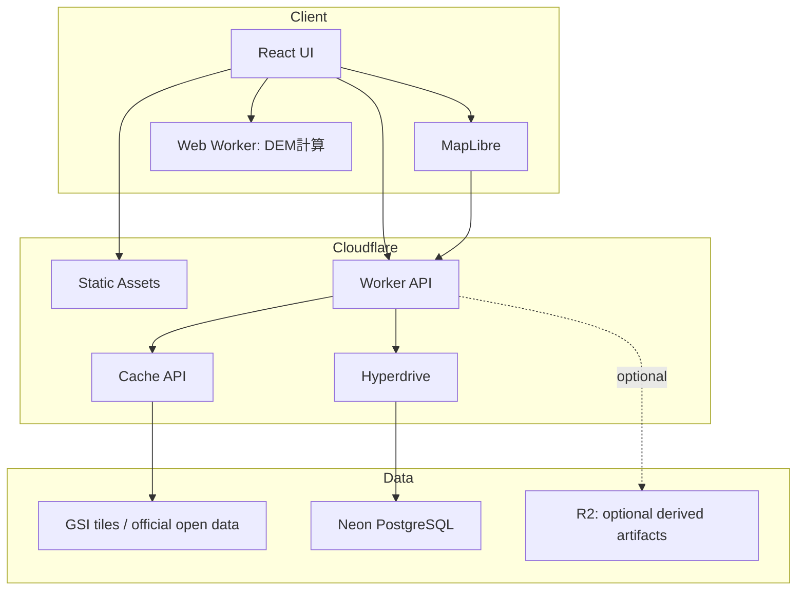
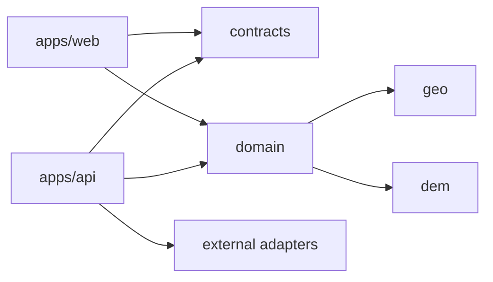
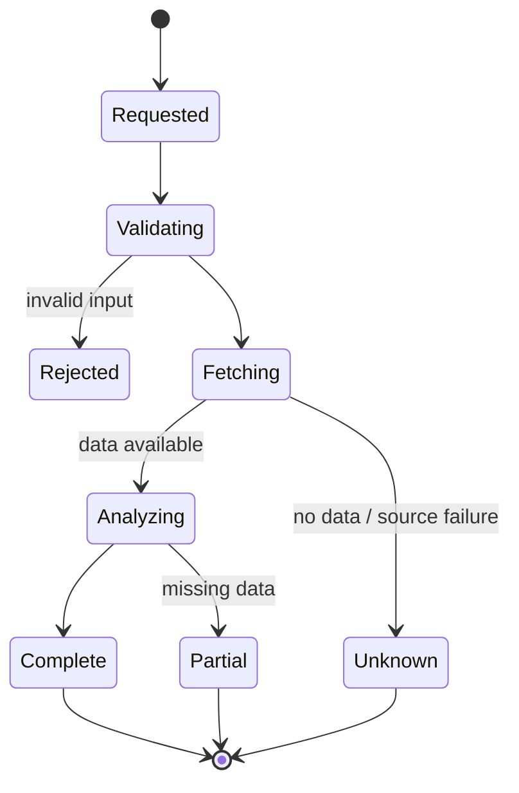
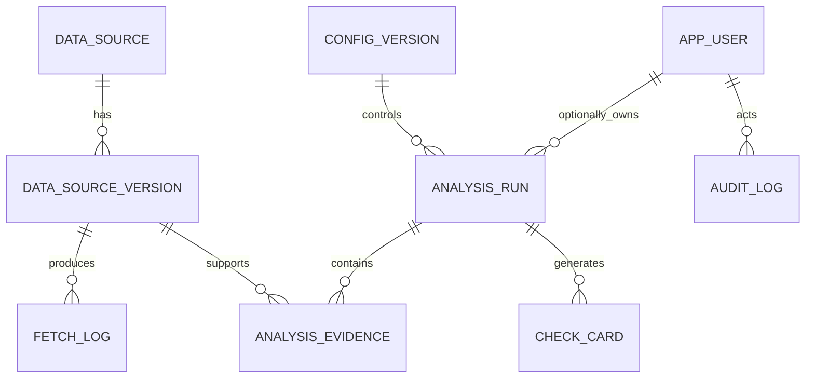
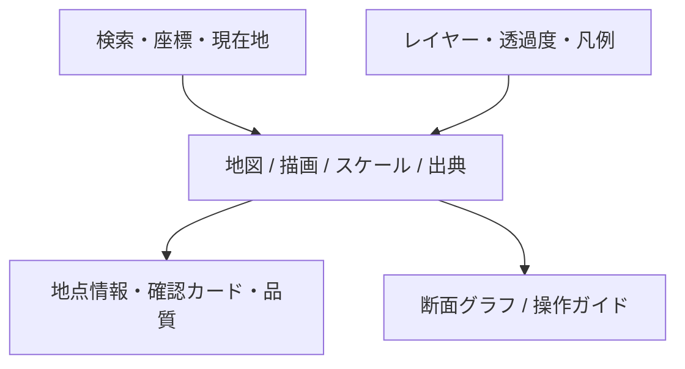
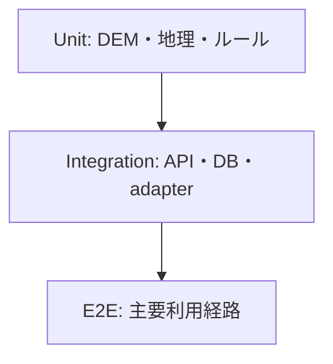
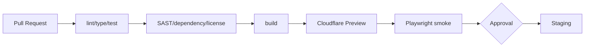

# Civil Terrain & Slope Risk Viewer 詳細設計仕様書

> Repository: `Civil-Terrain-Slope-Risk-Viewer`  
> 文書版: 1.0.0 / 作成日: 2026-07-16  
> 対象: MVP～Cloudflare限定検証環境

---

## 1. 目的・設計原則

本書は、要件定義をコード、データ構造、API、処理、テスト、運用へ落とし込むための詳細仕様を定義する。

### 1.1 原則

1. **Evidence First**: すべての表示結果に根拠データを紐付ける。
2. **Unknown is not Safe**: 欠損・範囲外・取得失敗は `UNKNOWN` とし、低リスクへ変換しない。
3. **Deterministic**: データ版・設定版・アルゴリズム版が同じなら同じ結果を返す。
4. **Adapter Isolation**: 外部データの仕様変更をアダプター内へ閉じ込める。
5. **Progressive Enhancement**: DBや一部外部レイヤー停止時も基本地図と説明を維持する。
6. **No Corporate Data**: MVPに社内情報の入力・保存口を設けない。

---

## 2. 技術スタック

| 区分       | 採用                                  | 備考                                                       |
| ---------- | ------------------------------------- | ---------------------------------------------------------- |
| Monorepo   | pnpm workspaces                       | Node.js LTS。バージョンは`.tool-versions`等で固定          |
| Frontend   | React + TypeScript + Vite             | SPA、strict mode                                           |
| Map        | MapLibre GL JS                        | 地図・ラスタ/ベクタレイヤー。GSI DEM独自形式は変換層を使用 |
| Chart      | ECharts または軽量同等品              | 断面図。依存採用時にライセンス確認                         |
| State      | TanStack Query + Zustand相当          | サーバ状態とUI状態を分離                                   |
| API        | Cloudflare Workers + TypeScript       | REST/JSON、OpenAPI 3.1                                     |
| Validation | Zod                                   | API境界・環境変数・外部レスポンス                          |
| DB         | Neon PostgreSQL                       | PostGISは起動時検査後に利用。必須化はPoC合格後             |
| DB Access  | `pg` + Hyperdrive                     | Cloudflare公式推奨経路。代替はNeon serverless driver       |
| Cache      | Cloudflare Cache API                  | ソース規約と更新性に応じてTTLを設定                        |
| Test       | Vitest + Testing Library + Playwright | 単体、統合、E2E                                            |
| CI/CD      | GitHub Actions + Wrangler             | preview / stagingを分離                                    |

### 2.1 バージョン管理方針

- 依存バージョンはlockfileで固定し、Renovate/Dependabot等の導入は別途判断する。
- `compatibility_date` はデプロイ時に意図して更新し、変更をPRレビュー対象にする。
- Node、pnpm、Wrangler、DB migration toolのバージョンをCIとローカルで一致させる。

---

## 3. 論理・物理構成



### 3.1 責務分担

| コンポーネント    | 責務                                                     |
| ----------------- | -------------------------------------------------------- |
| Web UI            | 入力、表示、アクセシビリティ、状態管理、出力要求         |
| Map module        | 座標変換、レイヤー制御、描画、凡例、帰属                 |
| Client Web Worker | 取得済み小範囲DEMのデコード・傾斜・断面処理              |
| Worker API        | 入力検証、外部取得、キャッシュ、分析調停、DB、レート制限 |
| Data adapters     | GSI等のURL生成、応答検査、正規化、出典付与               |
| Analysis domain   | DEMモザイク、傾斜、断面、分類集計、カード生成            |
| Neon              | 台帳、設定、取得ログ、匿名分析履歴、監査ログ             |

---

## 4. リポジトリ構成

```text
Civil-Terrain-Slope-Risk-Viewer/
├─ apps/
│  ├─ web/
│  │  ├─ src/app/
│  │  ├─ src/features/map/
│  │  ├─ src/features/location/
│  │  ├─ src/features/profile/
│  │  ├─ src/features/analysis/
│  │  ├─ src/features/report/
│  │  └─ src/workers/dem.worker.ts
│  └─ api/
│     ├─ src/routes/
│     ├─ src/middleware/
│     ├─ src/adapters/
│     ├─ src/repositories/
│     └─ src/index.ts
├─ packages/
│  ├─ domain/
│  ├─ dem/
│  ├─ geo/
│  ├─ contracts/
│  ├─ config/
│  └─ ui/
├─ db/
│  ├─ migrations/
│  └─ seeds/
├─ docs/
├─ fixtures/
│  ├─ dem/
│  ├─ landform/
│  └─ golden/
├─ tests/e2e/
├─ .github/workflows/
├─ wrangler.jsonc
├─ pnpm-workspace.yaml
├─ .env.example
└─ README.md
```

### 4.1 依存方向



`packages/domain` はCloudflare、React、DBライブラリに依存しない純粋TypeScriptとする。

---

## 5. ドメインモデル

### 5.1 主要型

```ts
type RiskStatus = "REFERENCE" | "CHECK_REQUIRED" | "UNKNOWN";
type QualityGrade = "A" | "B" | "C" | "D" | "UNKNOWN";
type DemSource = "DEM1A" | "DEM5A" | "DEM5B" | "DEM5C" | "DEM10B";

interface Coordinate {
  lat: number; // -90..90
  lon: number; // -180..180
}

interface Provenance {
  sourceId: string;
  sourceName: string;
  sourceUrl: string;
  termsUrl: string;
  retrievedAt: string;
  sourceVersion?: string;
  resolutionM?: number;
  processed: boolean;
  processingNote?: string;
}

interface QualitySummary {
  grade: QualityGrade;
  missingRatio: number; // 0..1
  sourceMix: Record<DemSource, number>;
  coverage: "FULL" | "PARTIAL" | "NONE";
  warnings: string[];
}

interface CheckCard {
  code: string;
  status: RiskStatus;
  title: string;
  observation: string;
  recommendedChecks: string[];
  distanceM?: number;
  evidenceIds: string[];
  algorithmVersion: string;
}
```

### 5.2 結果状態



---

## 6. データベース設計

### 6.1 拡張確認

初回migration前に以下を実行し、結果をデプロイ記録へ保存する。

```sql
SELECT name, default_version, installed_version
FROM pg_available_extensions
WHERE name = 'postgis';
```

利用可能なら `CREATE EXTENSION IF NOT EXISTS postgis;` を適用する。利用不可の場合でもMVPは動作させ、地点を `latitude/longitude`、範囲をGeoJSON `jsonb` として保存する。アプリ起動時の `capabilities` に `postgis: boolean` を返す。

### 6.2 ER図



### 6.3 テーブル

#### `data_sources`

| 列                      | 型           | 制約・内容                  |
| ----------------------- | ------------ | --------------------------- |
| id                      | uuid         | PK                          |
| source_key              | varchar(80)  | UNIQUE、例 `gsi_dem5a_png`  |
| name                    | varchar(200) | 表示名                      |
| provider                | varchar(200) | 提供機関                    |
| base_url                | text         | 許可済みURLテンプレート     |
| terms_url               | text         | 利用条件                    |
| attribution             | text         | 必須帰属文                  |
| cache_ttl_sec           | integer      | 0以上                       |
| enabled                 | boolean      | 既定falseで登録、審査後true |
| priority                | smallint     | 小さいほど優先              |
| created_at / updated_at | timestamptz  | UTC                         |

#### `data_source_versions`

| 列                      | 型                    | 内容                      |
| ----------------------- | --------------------- | ------------------------- |
| id                      | uuid PK               | 版ID                      |
| data_source_id          | uuid FK               | source                    |
| detected_version        | varchar(120) nullable | ETag/Last-Modified/公開版 |
| schema_hash             | char(64)              | 正規化スキーマSHA-256     |
| terms_checked_at        | timestamptz           | 規約確認日時              |
| active_from / active_to | timestamptz           | 適用期間                  |

#### `analysis_runs`

| 列                      | 型                 | 内容                                       |
| ----------------------- | ------------------ | ------------------------------------------ |
| id                      | uuid PK            | 分析ID                                     |
| public_id               | varchar(26) UNIQUE | 推測困難なULID                             |
| user_id                 | uuid nullable      | 匿名時null                                 |
| analysis_type           | varchar(30)        | `POINT` / `BUFFER` / `PROFILE` / `COMPARE` |
| center_lat / center_lon | numeric(9,6)       | 共有時は丸め方針適用                       |
| request_json            | jsonb              | 検証済み・自由URLなし                      |
| result_json             | jsonb              | 集計値、品質、カード                       |
| status                  | varchar(20)        | `COMPLETE/PARTIAL/UNKNOWN/FAILED`          |
| config_version_id       | uuid FK            | 閾値・設定版                               |
| algorithm_version       | varchar(40)        | SemVer/Git SHA                             |
| expires_at              | timestamptz        | 削除期限                                   |
| created_at              | timestamptz        | UTC                                        |

#### その他

- `analysis_evidence`: 分析ID、source version、タイル識別子のハッシュ、取得日時、品質、加工注記
- `check_cards`: card code、status、観測、推奨確認、evidence refs
- `fetch_logs`: request_id、source、host、status、latency、cache status、bytes、error code
- `config_versions`: slope bins、範囲上限、カードルール、schema version、承認者、適用日時
- `audit_logs`: actor、action、target、before/afterの差分、request_id、created_at

### 6.4 インデックス

```sql
CREATE INDEX idx_analysis_runs_created_at ON analysis_runs (created_at DESC);
CREATE INDEX idx_analysis_runs_expires_at ON analysis_runs (expires_at);
CREATE INDEX idx_fetch_logs_source_time ON fetch_logs (data_source_id, created_at DESC);
CREATE INDEX idx_fetch_logs_error_time ON fetch_logs (error_code, created_at DESC)
  WHERE error_code IS NOT NULL;
```

PostGIS利用時は地点geometryにGiST indexを追加する。生タイルの全量保管は行わない。

---

## 7. API設計

### 7.1 共通仕様

- Base path: `/api/v1`
- Content-Type: `application/json; charset=utf-8`
- 日時: ISO 8601 UTC
- 座標: EPSG:4326、経度→緯度の順序をAPI文書で固定
- ID: UUID/ULID。連番を公開しない
- 成功応答: `{ data, meta }`
- 失敗応答: RFC 9457相当のProblem Details形式
- `X-Request-Id` を受信/生成し、応答とログへ付与

### 7.2 エンドポイント

| Method | Path                                | 用途                           | 認証            |
| ------ | ----------------------------------- | ------------------------------ | --------------- |
| GET    | `/health/live`                      | プロセス生存                   | 不要            |
| GET    | `/health/ready`                     | DB・設定・主要依存の準備状態   | 制限可          |
| GET    | `/capabilities`                     | PostGIS、レイヤー、出力形式    | 不要            |
| GET    | `/sources`                          | 有効データソース・帰属         | 不要            |
| GET    | `/elevation`                        | 単点標高                       | 不要/Rate limit |
| POST   | `/analyses/point`                   | 地点・周辺分析                 | 不要/Rate limit |
| POST   | `/analyses/profile`                 | 断面分析                       | 不要/Rate limit |
| POST   | `/analyses/area`                    | 円/ポリゴン範囲分析            | Analyst         |
| GET    | `/analyses/{publicId}`              | 保存済み分析                   | 所有/共有設定   |
| POST   | `/analyses/{publicId}/exports`      | Markdown/CSV/JSON生成          | 所有/Rate limit |
| GET    | `/tiles/proxy/{source}/{z}/{x}/{y}` | 許可済みタイル取得・キャッシュ | 不要/Rate limit |
| GET    | `/admin/source-health`              | ソース健全性                   | DataAdmin       |

### 7.3 地点分析要求例

```json
{
  "center": { "lat": 35.681236, "lon": 139.767125 },
  "radiusM": 500,
  "layers": ["elevation", "slope", "landform"],
  "slopeBinsDeg": [0, 5, 15, 30, 45, 90],
  "persist": false
}
```

制約:

- `radiusM`: 50～2000（公開デモは1000まで）
- 緯度経度は有限数。NaN/Infinity/指数表記の異常入力を拒否
- `layers`: 許可済み列挙値のみ
- 公開APIのポリゴンは最大100頂点、最大4km²

### 7.4 応答概要

```json
{
  "data": {
    "analysisId": "01...",
    "status": "PARTIAL",
    "elevation": { "minM": 4.1, "maxM": 28.6, "meanM": 11.8 },
    "slope": { "maxDeg": 31.2, "meanDeg": 6.4, "bins": [] },
    "landforms": [],
    "cards": [],
    "quality": {
      "grade": "B",
      "missingRatio": 0.04,
      "coverage": "PARTIAL",
      "warnings": ["一部セルに標高値がありません"]
    },
    "evidence": []
  },
  "meta": {
    "requestId": "...",
    "algorithmVersion": "1.0.0",
    "generatedAt": "2026-07-16T09:00:00Z"
  }
}
```

### 7.5 エラーコード

| HTTP | code                        | 意味                                   |
| ---: | --------------------------- | -------------------------------------- |
|  400 | `INVALID_INPUT`             | 形式・範囲違反                         |
|  404 | `NO_COVERAGE`               | 対象地点にデータなし。安全を意味しない |
|  409 | `CONFIG_VERSION_CONFLICT`   | 再現条件の不一致                       |
|  413 | `ANALYSIS_AREA_TOO_LARGE`   | 範囲・点数上限超過                     |
|  422 | `INSUFFICIENT_DATA`         | 計算に必要な有効セル不足               |
|  429 | `RATE_LIMITED`              | 利用上限                               |
|  502 | `UPSTREAM_INVALID_RESPONSE` | 外部応答異常                           |
|  503 | `UPSTREAM_UNAVAILABLE`      | 外部停止・タイムアウト                 |
|  500 | `INTERNAL_ERROR`            | 内部異常。詳細は非公開                 |

---

## 8. 地理・DEM処理仕様

### 8.1 タイル座標

XYZ/Web Mercatorで、ズーム `z`、経度 `lon`、緯度 `lat` からタイル座標を求める。

\[
n=2^z,\quad x=\left\lfloor\frac{lon+180}{360}n\right\rfloor
\]

\[
y=\left\lfloor\left(1-\frac{\ln(\tan\varphi+\sec\varphi)}{\pi}\right)\frac{n}{2}\right\rfloor
\]

ここで \(\varphi=lat\times\pi/180\)。Web Mercatorの有効緯度 ±85.05112878 にクランプする。

### 8.2 DEMソース選択

1. 目標ズームと対象範囲から必要タイルを列挙する。
2. `DEM1A → DEM5A → DEM5B → DEM5C → DEM10B` の順で取得する。
3. 各セルは最初に得られた有効値を採用する。
4. 採用元をセルマスクとして保持し、`sourceMix` を集計する。
5. 取得数上限を超える場合は解像度を落とすか、要求を拒否する。無言で間引かない。

PNGは国土地理院仕様に従い、`x = 2^16R + 2^8G + B` とする。

- `x < 2^23`: `h = x × 0.01m`
- `x = 2^23`: 無効値
- `x > 2^23`: `h = (x - 2^24) × 0.01m`

負標高は正当な値として扱い、欠損へ変換しない。

### 8.3 傾斜計算

MVPは3×3近傍のHorn法を採用する。中心セル周辺を次のように置く。

```text
z1 z2 z3
z4 z5 z6
z7 z8 z9
```

\[
\frac{\partial z}{\partial x}=\frac{(z_3+2z_6+z_9)-(z_1+2z_4+z_7)}{8\Delta x}
\]

\[
\frac{\partial z}{\partial y}=\frac{(z_7+2z_8+z_9)-(z_1+2z_2+z_3)}{8\Delta y}
\]

\[
slope_{deg}=\tan^{-1}\left(\sqrt{(\partial z/\partial x)^2+(\partial z/\partial y)^2}\right)\frac{180}{\pi}
\]

- `Δx`, `Δy` は緯度に応じた実地距離を使用し、固定ピクセル長にしない。
- 近傍に欠損があれば既定ではそのセルを欠損とする。補間はMVPで行わない。
- タイル外周1セル以上を隣接タイルから取得する。
- 区分値 `[0,5,15,30,45,90]` は視覚表示の既定値であり、法令・設計基準ではない。

### 8.4 断面分析

1. 入力LineStringを測地距離で計測する。
2. DEM実効解像度以下にならない間隔で等距離サンプリングする。
3. 既定サンプル上限2,000点。超過時は間隔を明示して調整する。
4. 隣接標高から区間傾斜を算出する。
5. 有効区間だけで累積上昇・下降を計算し、欠損区間をグラフ上で切断する。
6. 線の総延長、サンプル間隔、欠損率、採用DEM構成を表示する。

### 8.5 地形分類

- 取得したベクトルタイル/GeoJSONをアダプターで共通GeoJSONへ正規化する。
- `original_code`、`normalized_class`、`source_dataset`、`source_date`、`description`を保持する。
- 主要正規化区分: `MOUNTAIN_SLOPE`、`CLIFF_TERRACE_CLIFF`、`LANDSLIDE`、`DEPRESSION_SHALLOW_VALLEY`、`FLOODPLAIN_COASTAL_PLAIN`、`BACK_MARSH`、`FORMER_RIVER_CHANNEL`、`VALLEY_PLAIN`、`ARTIFICIAL_FILL`、`OTHER`。
- 境界付近は単一区分へ断定せず、交差する全分類と距離を表示する。

### 8.6 「要確認カード」生成

ルールはDBの`config_versions.rule_json`で版管理し、コードへの直書きを避ける。

```json
{
  "ruleId": "steep-slope-observed",
  "when": { "metric": "slope.maxDeg", "gte": 30 },
  "status": "CHECK_REQUIRED",
  "requires": ["quality.coverage != NONE"],
  "evidence": ["dem", "slope_algorithm"]
}
```

禁止事項:

- 複数カードを単純加算して「総合危険度」を作らない。
- `UNKNOWN`を数値0として集計しない。
- 公的ハザード区域と地形由来の観測を同一ラベルで混同しない。

---

## 9. 外部データアダプター

### 9.1 インターフェース

```ts
interface DataAdapter<TRequest, TNormalized> {
  readonly sourceKey: string;
  validateRequest(input: unknown): TRequest;
  buildRequests(input: TRequest): URL[];
  fetch(input: TRequest, ctx: FetchContext): Promise<RawArtifact[]>;
  normalize(raw: RawArtifact[], ctx: NormalizeContext): Promise<TNormalized>;
  provenance(raw: RawArtifact[]): Provenance[];
}
```

### 9.2 SSRF・取得制御

- URLは利用者入力から組み立てず、ソース台帳のテンプレートへ検証済み `z/x/y` のみ埋める。
- `https:` のみ許可し、リダイレクト先もallowlist検査する。
- private/link-local/localhost IPへの解決を拒否する。
- 応答上限、MIME、PNG署名、JSON schema、タイムアウトを検査する。
- 429/5xxは指数バックオフ＋ジッターで最大2回まで。クライアント切断後の不要処理を中止する。

### 9.3 キャッシュキー

```text
v1:{sourceKey}:{sourceVersion}:{z}:{x}:{y}:{normalizerVersion}
```

- 外部応答のETag/Last-Modifiedを可能な範囲で保持する。
- 負のキャッシュは短TTL（例: 5分）とし、長期に「データなし」を固定しない。
- 帰属・規約上キャッシュ不可のソースは`cache_ttl_sec=0`にする。

---

## 10. UI詳細

### 10.1 地図画面レイアウト



### 10.2 状態表示

| 状態     | アイコン | 文言                | 色以外の手掛かり |
| -------- | -------- | ------------------- | ---------------- |
| 参考     | ℹ️       | 参考情報            | 円形アイコン     |
| 要確認   | ⚠️       | 追加確認が必要      | 三角形＋太字     |
| 判定不能 | ❔       | データ不足/取得失敗 | 斜線パターン     |
| 処理中   | ⏳       | 分析中              | progressbar      |

### 10.3 現在地

- `navigator.geolocation` は利用者操作でのみ呼び出す。
- 精度半径を地図に表示し、端末位置とDEM標高が別物であることを説明する。
- 現在地座標は`persist=true`を明示選択しない限りDBへ保存しない。

### 10.4 出力テンプレート

Markdownレポートは以下を必須とする。

1. タイトル・生成日時・分析ID
2. 対象座標・範囲・入力条件
3. 標高・傾斜・地形分類の観測結果
4. 要確認カードと推奨する追加確認
5. 欠損率・品質・採用DEM構成
6. データ出典・利用条件URL・加工注記
7. アルゴリズム版・設定版
8. 免責（初期確認支援であり確定判断ではない）

---

## 11. 認証・認可

### 11.1 ロール

| Role        | 閲覧 | 分析 | 永続保存 | ソース設定 | 監査 |
| ----------- | :--: | :--: | :------: | :--------: | :--: |
| Anonymous   |  ✓   | 制限 |    -     |     -      |  -   |
| Viewer      |  ✓   |  ✓   |    -     |     -      |  -   |
| Analyst     |  ✓   |  ✓   |    ✓     |     -      |  -   |
| DataAdmin   |  ✓   |  ✓   |    ✓     |     ✓      | 読取 |
| SystemAdmin |  ✓   |  ✓   |    ✓     |     ✓      |  ✓   |

- 認証はCloudflare Accessの検証済みJWTをWorkerで検証する。
- メールアドレス等は必要最小限とし、内部ユーザーIDへ不可逆/安定マッピングする。
- UI表示だけでなくAPIで権限を強制する。

---

## 12. セキュリティ仕様

### 12.1 HTTP

- `Content-Security-Policy`: `default-src 'self'`を基準に地図・公式タイルの必要先のみ許可
- `frame-ancestors 'none'`（埋込要件が出た場合は再設計）
- `X-Content-Type-Options: nosniff`
- `Referrer-Policy: strict-origin-when-cross-origin`
- `Permissions-Policy: geolocation=(self)`
- HSTSはドメイン全体の運用影響を確認後に設定

### 12.2 アプリケーション

- 全API入力をZodで検証し、未知フィールドを拒否または除去する方針を統一する。
- SQLはパラメータ化し、動的識別子は許可リストで選択する。
- Markdown出力はHTMLを無効化し、ファイル名・CSVセルの式注入を無害化する。
- ログにDB URL、Authorization、Cookie、Access JWT、完全なIPを出力しない。
- 公開分析APIはIP/セッション/経路単位でRate Limitを設定する。

### 12.3 Secret

| Secret/Binding              | 保管               | Git                  |
| --------------------------- | ------------------ | -------------------- |
| Hyperdrive binding          | Cloudflare binding | ID以外の秘密値は不可 |
| DB資格情報                  | Hyperdrive/Secret  | 禁止                 |
| Access audience/team domain | Secret/環境設定    | 非秘密項目のみ可     |
| Source API key（将来）      | Worker Secret      | 禁止                 |

`.env.example`には名前と説明だけを記載し、実値・実ホストを入れない。

---

## 13. ログ・監視

### 13.1 構造化ログ

```json
{
  "timestamp": "2026-07-16T09:00:00Z",
  "level": "info",
  "event": "upstream_fetch_completed",
  "request_id": "...",
  "source_key": "gsi_dem5a_png",
  "status": 200,
  "latency_ms": 142,
  "cache": "HIT",
  "bytes": 43821
}
```

座標はログにそのまま残さず、運用上必要な場合のみ粗いgeohashまたはタイルIDを用いる。

### 13.2 SLI/SLO候補

| SLI           |     目標 | アラート例              |
| ------------- | -------: | ----------------------- |
| API成功率     | 99.0%/月 | 5分窓で95%未満          |
| 地点分析p95   |  5秒以内 | 15分継続で8秒超         |
| GSI取得成功率 |      98% | source別に10分で90%未満 |
| 欠損急増      | 平常範囲 | 地域横断で2倍超         |
| DB接続失敗    | 0.5%未満 | 5分で2%超               |

### 13.3 ヘルスチェック

- `live`: event loopが応答できることのみ。外部依存を呼ばない。
- `ready`: 設定ロード、DB簡易照会、主要ソース設定の存在を確認。外部タイル全件取得はしない。
- 定期監視は代表タイルのHEAD/GETとスキーマ検証を低頻度で行い、提供元へ負荷を掛けない。

---

## 14. テスト設計

### 14.1 テストピラミッド



### 14.2 必須単体テスト

| ID         | 対象       | ケース                                |
| ---------- | ---------- | ------------------------------------- |
| UT-DEM-01  | PNG decode | 0m、正標高、負標高、無効値            |
| UT-DEM-02  | Mosaic     | ソース優先、混在、全欠損              |
| UT-GEO-01  | XYZ        | 日付変更線、赤道、高緯度、タイル端    |
| UT-SLP-01  | Horn       | 平面0°、既知勾配、欠損近傍            |
| UT-PRF-01  | Profile    | 上昇、下降、欠損区間、上限点数        |
| UT-RULE-01 | Card       | 閾値直前/一致/超過、UNKNOWN優先       |
| UT-SEC-01  | URL        | allowlist、redirect、private host拒否 |

### 14.3 ゴールデンデータ

- 小さなDEM PNG fixtureと期待標高配列をリポジトリへ保存する。
- 実公開タイルをCIの必須試験に直接使用しない。外部変化でCIが不安定になるため、夜間の契約試験に分離する。
- 代表地点は山地、平地、低地、負標高、海岸、DEM境界、データ範囲外を含める。
- fixtureの出典、取得日、利用可否を`fixtures/README.md`へ記載する。

### 14.4 E2E

1. 座標入力→標高表示→根拠表示
2. レイヤー切替→凡例・帰属が更新
3. 断面線描画→グラフ→Markdown出力
4. 外部503→判定不能と再試行案内
5. 一部欠損→PARTIAL、欠損区間の非補間表示
6. モバイル幅→ボトムシートと主要操作
7. キーボードのみで検索・レイヤー・結果参照

---

## 15. CI/CD



### 15.1 PR必須チェック

- format、lint、TypeScript strict
- unit/integration test、主要coverage threshold
- OpenAPI schema lintと破壊的変更検出
- migration dry-runとdown/restore手順確認
- Secret scan、dependency audit、license policy
- build size予算、アクセシビリティsmoke

### 15.2 環境

| 環境           | データ                            | DB                        | 入口              |
| -------------- | --------------------------------- | ------------------------- | ----------------- |
| local          | fixture優先、任意で公式公開データ | Neon dev branchまたはmock | localhost         |
| preview        | fixture＋制限付き公式データ       | PR単位branchを評価        | 一時URL           |
| staging        | 公式公開データ                    | staging branch            | Cloudflare Access |
| production候補 | 承認済みソース                    | production branch         | 別途リリース判定  |

Linuxローカル、Docker volume、SQLiteを正本にしない。

---

## 16. 障害・縮退設計

| 障害         | UI                             | API         | 運用                           |
| ------------ | ------------------------------ | ----------- | ------------------------------ |
| GSI DEM停止  | 既存表示を古いと明示、分析不可 | 503/UNKNOWN | source alert、過度な再試行禁止 |
| 地形分類停止 | DEM分析のみ継続                | PARTIAL     | カードの根拠不足を表示         |
| Neon停止     | 一時分析のみ                   | 保存API 503 | DB alert、復旧後整合確認       |
| Cache障害    | 直接取得を制限付きで試行       | latency警告 | コスト・負荷監視               |
| 設定破損     | last-known-good設定            | ready=false | rollback                       |
| 不正データ   | 当該ソース隔離                 | 502         | schema差分確認、手動再有効化   |

### 16.1 再実行

- GETは冪等。POST分析は`Idempotency-Key`対応を検討する。
- 同一キー・同一bodyは同じ分析結果を返し、異なるbodyは409とする。
- 外部取得の再試行で二重保存しない。

---

## 17. データ保持・削除

- 匿名分析は既定非保存。共有/出力に必要な場合のみ期限付き保存。
- 削除ジョブは`expires_at < now()`を小分けで削除し、監査件数を記録する。
- タイルキャッシュはデータソースごとのTTLに従い、規約変更時は該当namespaceを失効できる設計にする。
- DBバックアップはNeon契約機能を確認し、復元先を別branch/DBとして四半期に一度検証する。
- 個人情報・会社情報の誤入力が判明した場合の削除手順と連絡先を運用手順に記載する。

---

## 18. 実装順序

| Sprint | 実装                                     | 完了条件                 |
| ------ | ---------------------------------------- | ------------------------ |
| 0      | monorepo、CI、fixture、データ台帳        | offline testが安定実行   |
| 1      | MapLibre、GSI base/slope/hillshade、帰属 | 地図レイヤーE2E合格      |
| 2      | DEM PNG decode、単点標高、品質           | 既知値・負標高・欠損合格 |
| 3      | DEM mosaic、Horn傾斜、周辺統計           | タイル境界テスト合格     |
| 4      | 断面、地形分類、カード                   | 根拠紐付け100%           |
| 5      | Neon、分析履歴、出力、監視               | 保存/復元/縮退テスト合格 |
| 6      | UAT、性能、セキュリティ、文書            | 重大不具合0、検証承認    |

---

## 19. Definition of Done

- [ ] 要件IDとPR/テストが追跡可能
- [ ] 外部データごとに出典・規約・確認日が登録済み
- [ ] `UNKNOWN`、`PARTIAL`、`COMPLETE`を全画面・出力で一貫表示
- [ ] DEM計算のゴールデンテストと境界テスト合格
- [ ] ログにSecret・精密位置・個人情報が出ない
- [ ] preview/stagingのデプロイとロールバックを確認
- [ ] DBバックアップ/復元手順を検証
- [ ] README、要件定義、詳細設計、OpenAPI、運用手順が現行コードと一致
- [ ] UAT参加者が「初期確認支援であり確定判断ではない」と理解できる

---

## 20. 参照仕様

- [地理院タイル一覧](https://maps.gsi.go.jp/development/ichiran.html)
- [標高タイルの詳細仕様](https://maps.gsi.go.jp/development/demtile.html)
- [ベクトルタイル「地形分類」](https://www.gsi.go.jp/bousaichiri/lfc_index.html)
- [国土地理院コンテンツ利用規約](https://www.gsi.go.jp/kikakuchousei/kikakuchousei40182.html)
- [Cloudflare Workers - Neon](https://developers.cloudflare.com/workers/databases/third-party-integrations/neon/)
- [Cloudflare Hyperdrive - Neon](https://developers.cloudflare.com/hyperdrive/examples/connect-to-postgres/postgres-database-providers/neon/)
- [MapLibre GL JS](https://maplibre.org/maplibre-gl-js/docs/)
- [PostGIS](https://postgis.net/)

> 実装時は公式仕様を再確認し、URL・ズーム範囲・利用条件・ライブラリAPIをテストで固定すること。
